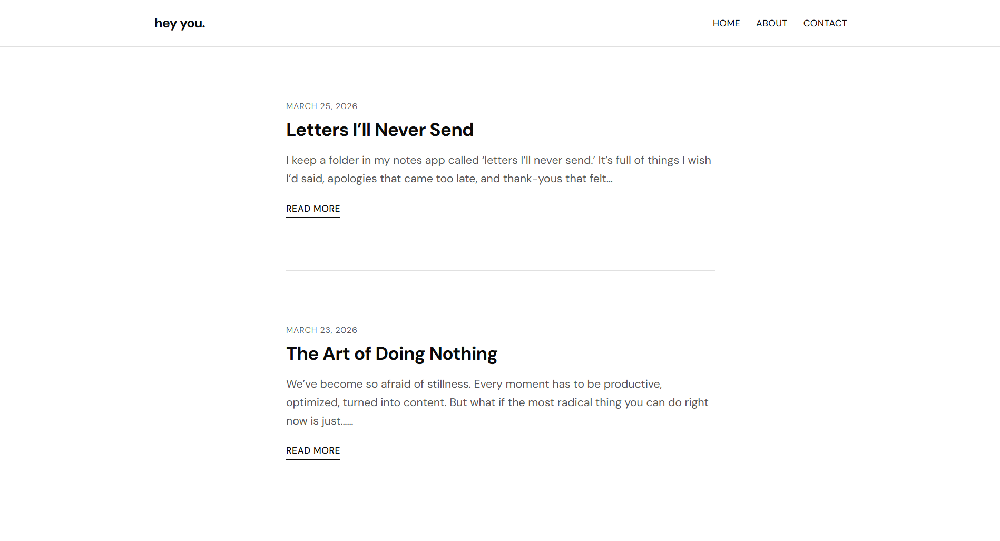
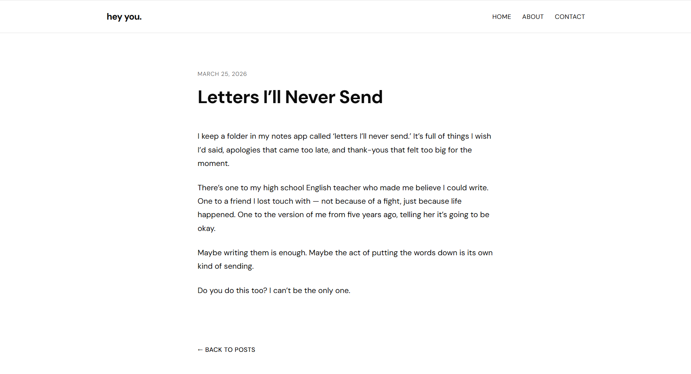
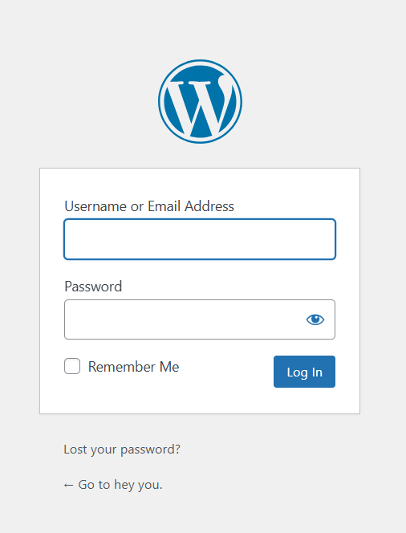
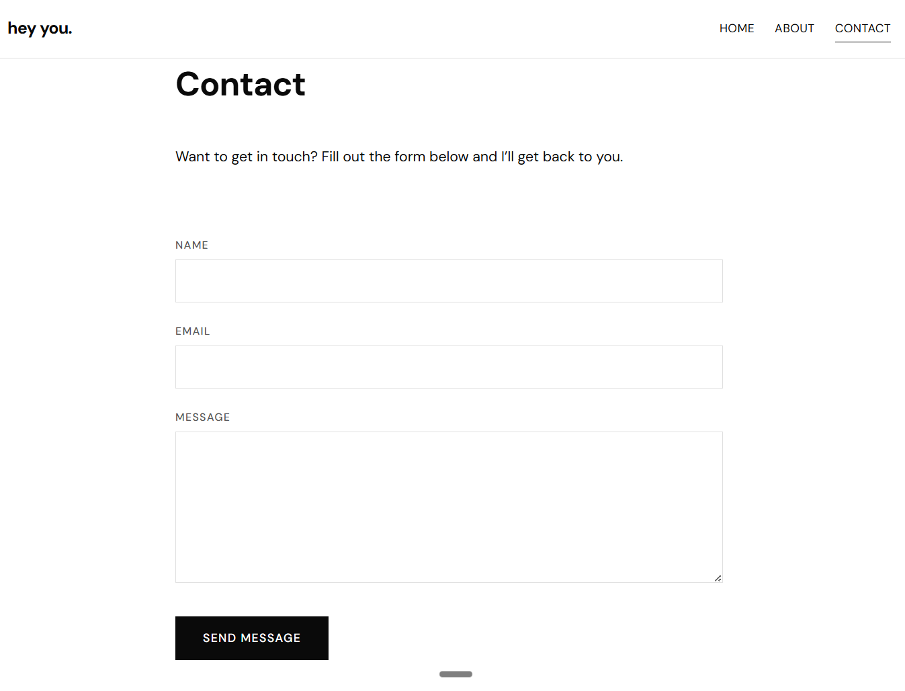
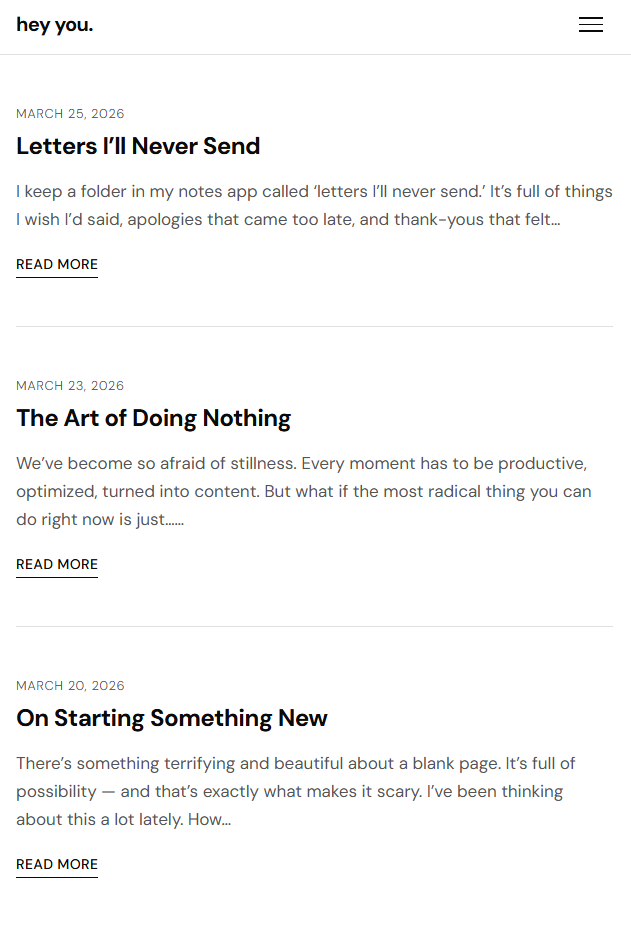

# Blog Website - Client Project

## Finn Saunders

### Overview:

A client approached me to design and build a personal blog where she could publish her own writing. She requested a simple, clean black-and-white design to keep the focus entirely on the content. I built a custom WordPress site with a private admin login so she can create, edit, and manage her own posts without needing any technical knowledge. The site was designed to be easy to maintain and fully functional on both desktop and mobile.

### Site Features:

- Custom-designed blog with a minimalist black-and-white aesthetic per client request
- Blog index page with post previews and pagination
- Individual post pages with full content display
- About page and contact page with form that redirects inquiries to the client's email
- Private admin login for the blog owner to publish and manage posts
- Mobile responsive layout with collapsible navigation
- Accessible design with keyboard navigation support

### Screenshots:

*Screenshot of Homepage / Blog Index*:

*Screenshot of Single Post View*:

*Screenshot of Admin Dashboard*:

*Screenshot of Contact Page*:

*Screenshot of Mobile View*:

