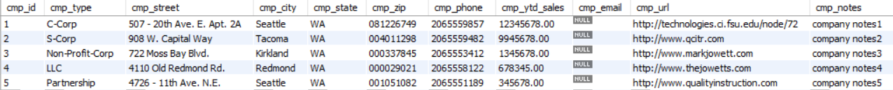
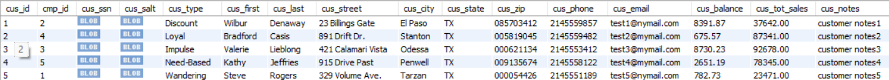
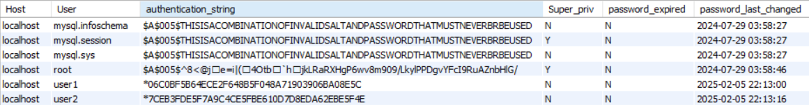
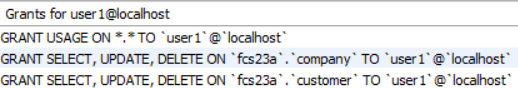
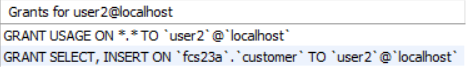

# lis3781 Advanced Database Management

## Finn Saunders

### Assignment #2 Requirements:

1. Tables and insert statements.
2. Include indexes and foreign key SQL statements.
3. Include *your* query result sets, including grant statements.
4. The following tables should be created and populated with at least 5 records both locally and to the CCI server.

#### README.md file should include the following items:

* Screenshot of my populated tables
* Screenshot of my created users
* Link to my [lis3781_a2_solutions.sql](docs/a2_solutions.sql) file including tables, data and the commands I used.

#### Assignment Screenshots:
##### Company Data

##### Customer Data

##### Created Users (user1, user2)

##### User1 privileges

##### User1 privileges in effect

##### User2 privileges

##### User2 privileges in effect

