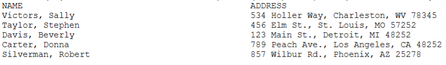
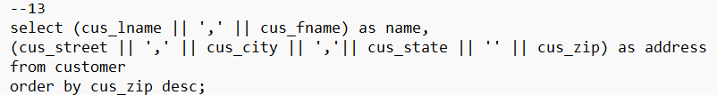
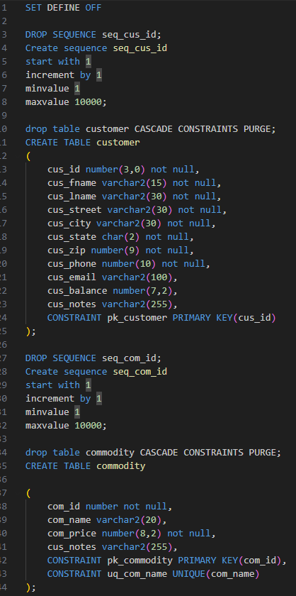
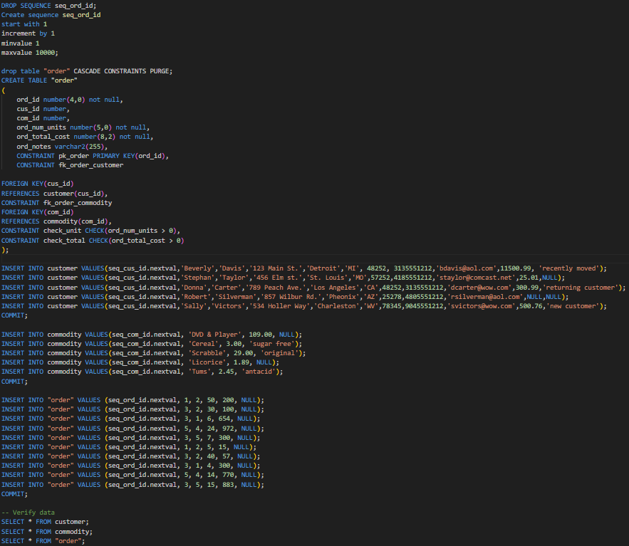

# lis3781 Advanced Database Management

## Finn Saunders

### Assignment #3 Requirements:

1. Screenshot of *your* SQL code used to create and populate your tables
2. Screenshot: At least *one* required report and SQL code solution;
3. Link to your lis3781_a3_solutions.sql file—including tables AND data!

#### Linked SQL FILE
[a3_solutions](docs/a3_solutions.sql)

#### Assignment Screenshots:

| report | report code |
|-------------------------|-------------------------|
|  |  |

#### Creating Tables

| Creating tables and | inserting data |
|-------------------------|-------------------------|
|  |  |

