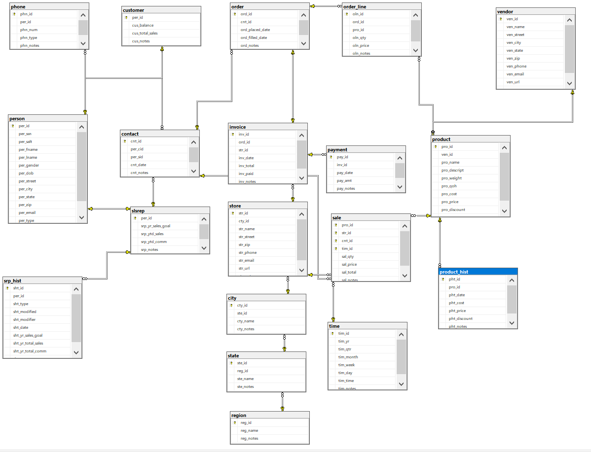
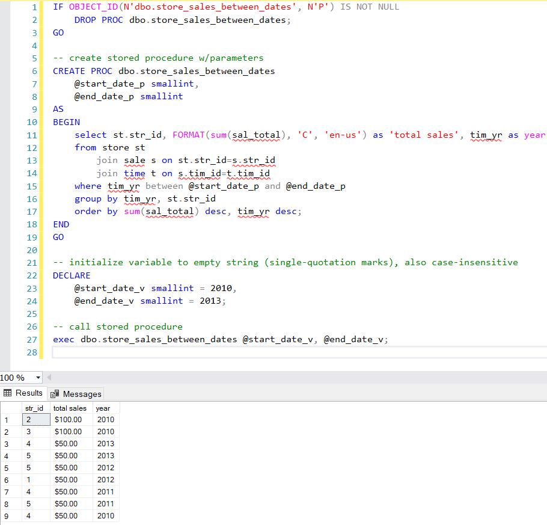

# lis3781 Advanced Database Management

## Finn Saunders

### Assignment #5 Requirements:

#### Business Rules
* Expanding upon the high-volume home office supply company’s data tracking requirements, the CFO
requests your services again to extend the data model’s functionality. The CFO has read about the
capabilities of data warehousing analytics and business intelligence (BI), and is looking to develop a
smaller data mart as a test platform. He is under pressure from the members of the company’s board of
directors who want to review more detailed sales reports based upon the following measurements:

1. Product
2. Customer
3. Sales representative
4. Time (year, quarter, month, week, day, time)
5. Location

#### README.md file should include the following items:

1. Screenshot of *your* ERD;
2. Screenshot: At least *one* required report (i.e., exercise below), and SQL code solution.
3. Bitbucket repo links: *Your* lis3781 Bitbucket repo link
4. Link to your [lis3781_a5_solutions.sql](docs/solutions.sql) file—including tables AND data!

#### Assignment Screenshots:

##### ERD

##### Report with Code
