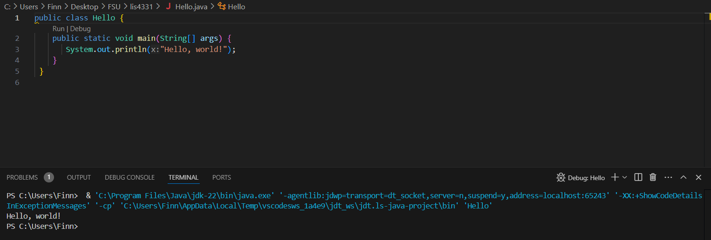
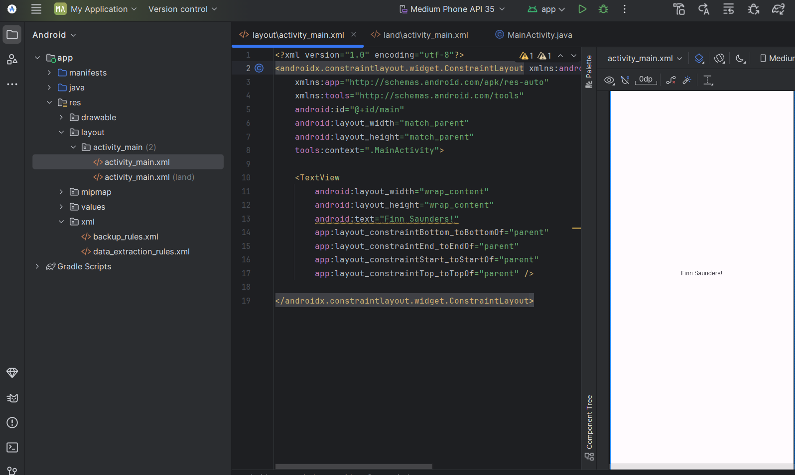
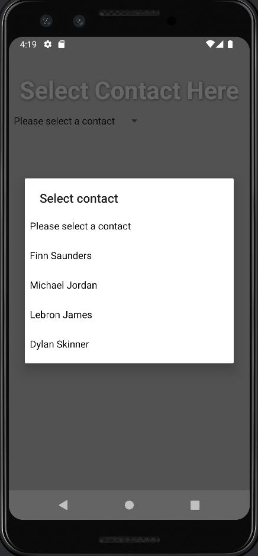
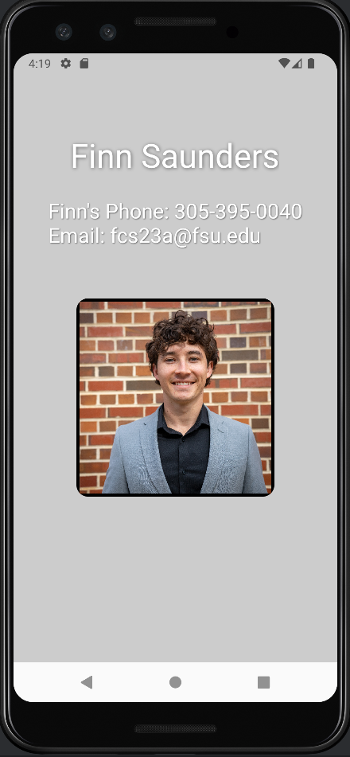

# lis4331 Advanced Mobile Application Development

## Finn Saunders

### Assignment #1 Requirements:

1. Distributed Version control with Git and Bitbucket
2. Development installations
3. Chapter Questions (1 & 2)
4. Develop Contacts App

### Bonus work I did
* Create a GIF to showcase the apps functionality
* Create a spinner to navigate between contacts
* Add background color
* Add shadow to text to improve aesthetics

#### README.md file should include the following items:

* Screenshot of java Hello
* Screenshot of Android Studio - My First App
* Screenshot of Android Studio - Contacts App
* git commands with short descriptions

> #### Git commands w/short descriptions:

1. git init - Create an empty Git repository or reinitialize an existing one
2. git status - Show the working tree status
3. git add - Add file contents to the index
4. git commit - Record changes to the repository
5. git push - Update remote refs along with associated objects
6. git pull - Fetch from and integrate with another repository or a local branch
7. git-log - Show commit logs

#### Assignment Screenshots:

| JDK Installation Screenshot | Screenshot of Android Studio |
|-------------------------|-------------------------|
|  |  |

### My Java Code
1. [Home Page Java](docs/MainActivity.java)
2. [Contacts Page Java](docs/Details.java)

| App GIF | Screenshot of Contacts Spinner | Screenshot of Contact Details |
|-------------------------|-------------------------|-------------------------|
|  |  |  |
