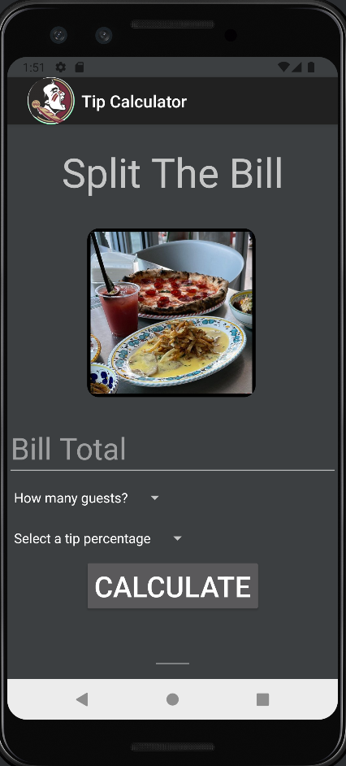
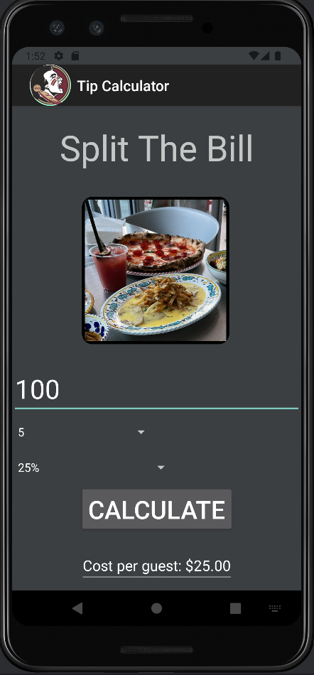
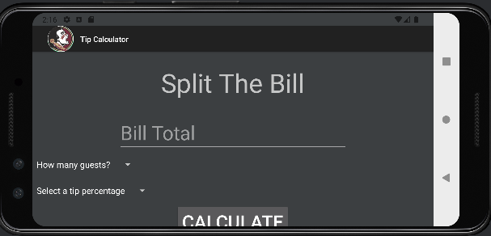
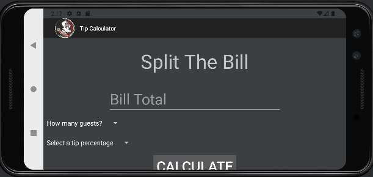
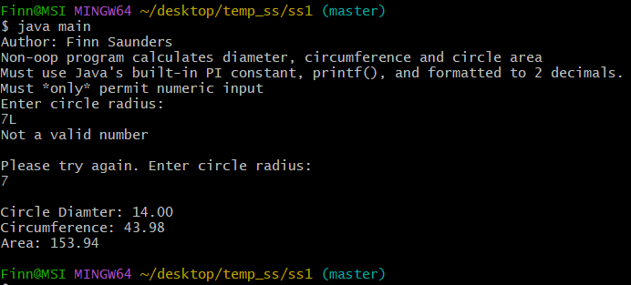
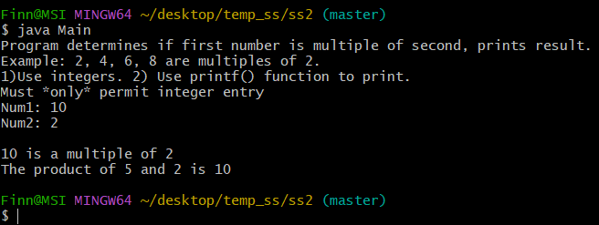
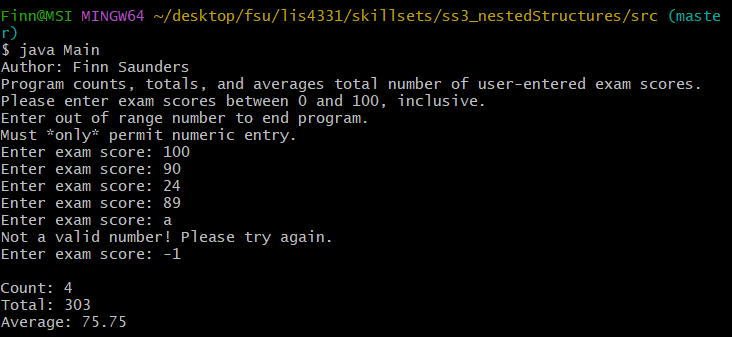

# lis4331 Advanced Mobile Application Development

## Finn Saunders

### Assignment #2 Requirements:

1. Must allow for including decimal point for bill total
2. Drop-down menu for total number of guests (including yourself): 1 – 10
3. Drop-down menu for tip percentage (5% increments): 0 – 25
4. Must add background color(s) or theme
5. Must create and display launcher icon image

#### README.md file should include the following items:

* Screenshots/GIF of the app running and its functionality
* Images of skillsets 1, 2 and 3 running

#### Assignment Screenshots:

| Tip Calculator GIF | Screenshot 1 | Screenshot 2 |
|-------------------------|-------------------------|-------------------------|
|  |  |  |

#### Horizontal Functionality

| Screenshot 1 | Screenshot 2 |
|-------------------------|-------------------------|
|  |  |

#### Skillset Screenshots:
##### (Click on the Main/Methods to view my code)
|SS1 Circle Calculator - [Main.java](../skillsets/ss1_circle/src/main.java) , [Methods.java](/skillsets/ss1_circle/src/Methods.java) | SS2 Multiple Calculator - [Main.java](../skillsets/ss2_multiNum/src/Main.java) , [Methods.java](../skillsets/ss2_multiNum/src/Methods.java) | SS3 Nested Structures - [Main.java](../skillsets/ss3_nestedStructures/src/Main.java) , [Methods.java](../skillsets/ss3_nestedStructures/src/Methods.java) |
|-------------------------|-------------------------|-------------------------|
|  |  |  |

