# lis4331 Advanced Mobile Application Development

## Finn Saunders

### Assignment #3 Requirements:

1. Field to enter U.S. dollar amount: 1 – 100,000
2. Must include toast notification if user enters out-of-range values
3. Radio buttons to convert from U.S. to Euros, Pesos and Canadian currency (must be vertically and horizontally aligned)
4. Must include correct sign for euros, pesos, and Canadian dollars
5. Must add background color(s) or theme
6. Create and display launcher icon image
7. App *must* be scrollable—*both* horizontally and vertically
8. Create Splash/Loading Screen

#### README.md file should include the following items:

1. Course title, your name, assignment requirements, as per A1;
2. Screenshot of running application’s splash screen;
3. Screenshot of running application’s unpopulated user interface;
4. Screenshot of running application’s toast notification;
5. Screenshot of running application’s converted currency user interface;

#### Assignment Screenshots:

| Splash Screen | Unpopulated UI |
|-------------------------|-------------------------|
| 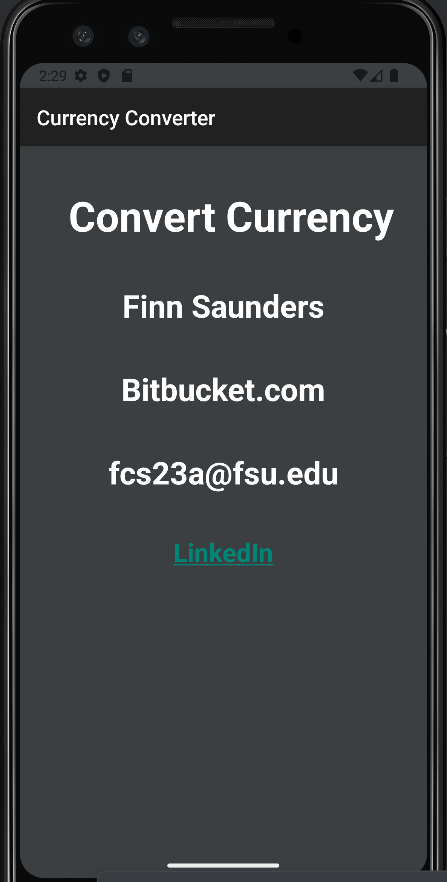 | 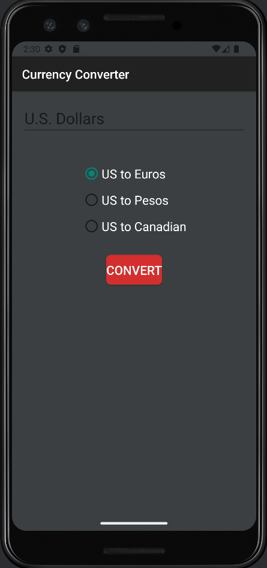 |

| Toast Notification | Converted Currency |
|-------------------------|-------------------------|
| 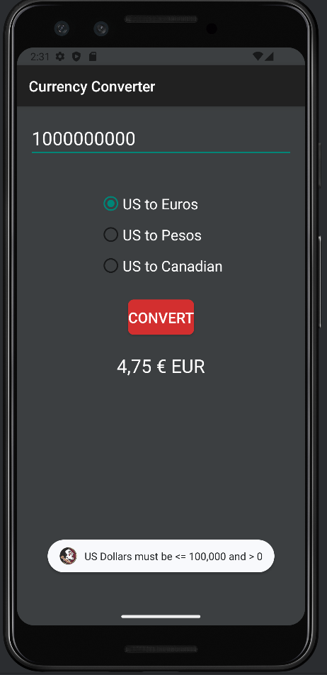 | 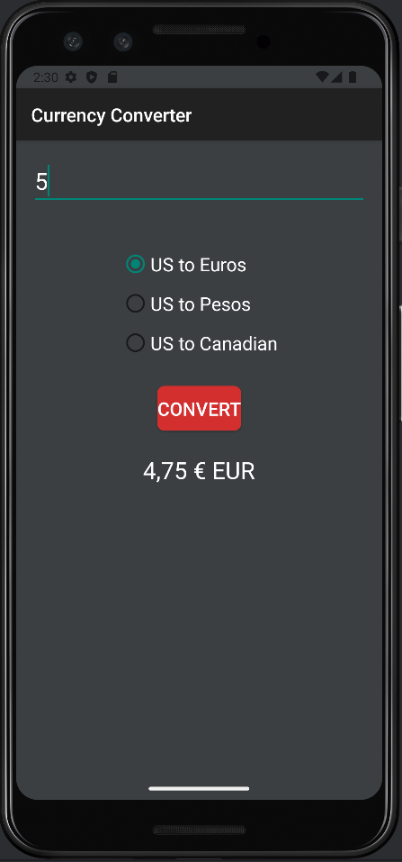 |

##### Scrolling Functionality

| Scroll 1 | Scroll 2 |
|-------------------------|-------------------------|
| 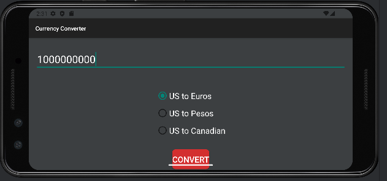 | 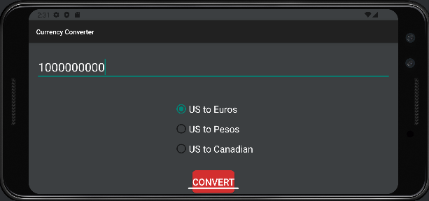 |

#### Skill sets

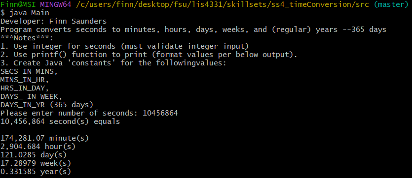

##### Skill set 5

| 1 | 2 | 3 |
|-------------------------|-------------------------|-------------------------|
| 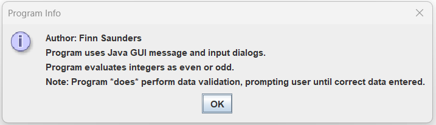 | 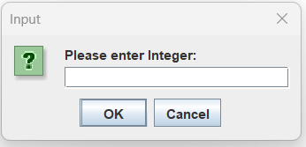 | 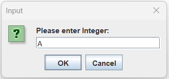 |
| 4 | 5 |
|-------------------------|-------------------------|
| 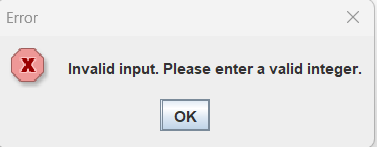 | 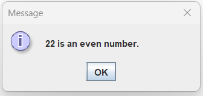 |

##### Skill set 6

| 1 | 2 | 3 |
|-------------------------|-------------------------|-------------------------|
| 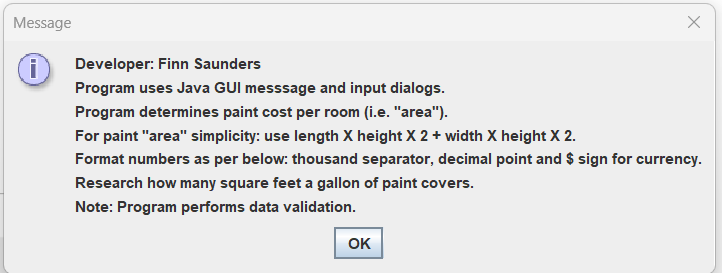 | 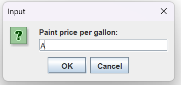 | 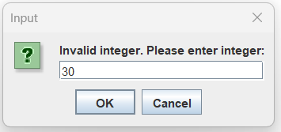 |

| 4 | 5 | 6 |
|-------------------------|-------------------------|-------------------------|
| 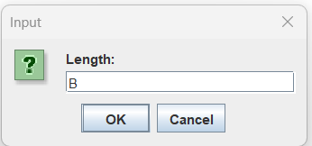 |  | 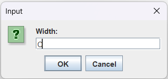 |

| 7 | 8 | 9 | 10 |
|-------------------------|-------------------------|-------------------------|-------------------------|
| 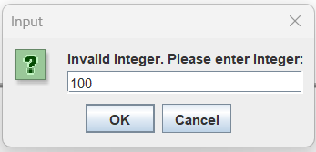 | 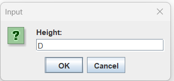 | 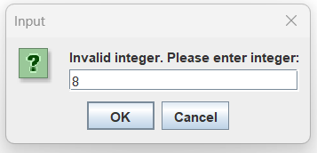 | 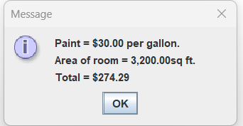 |