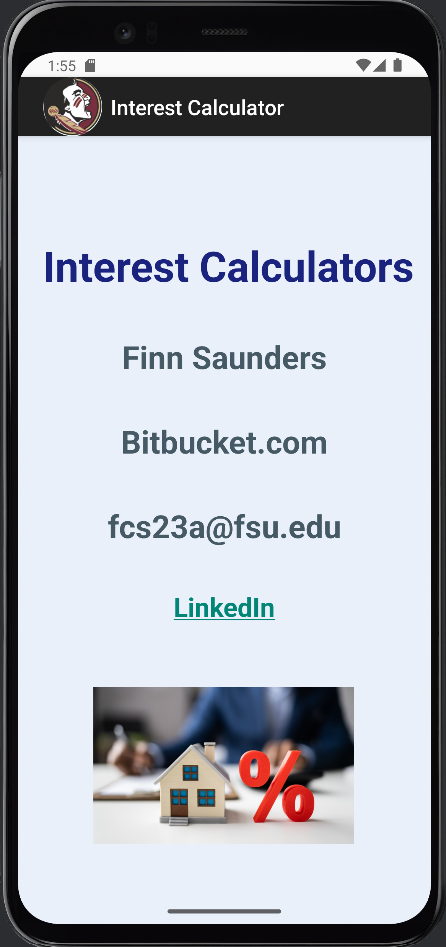
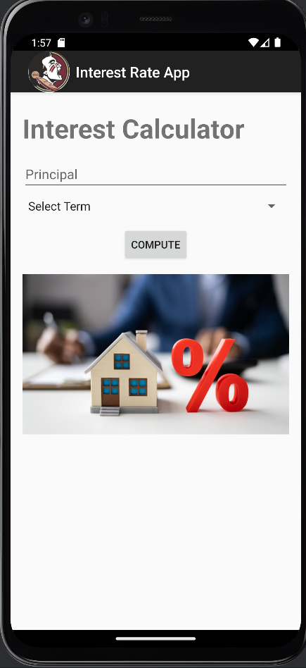
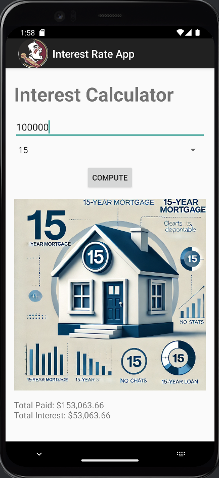
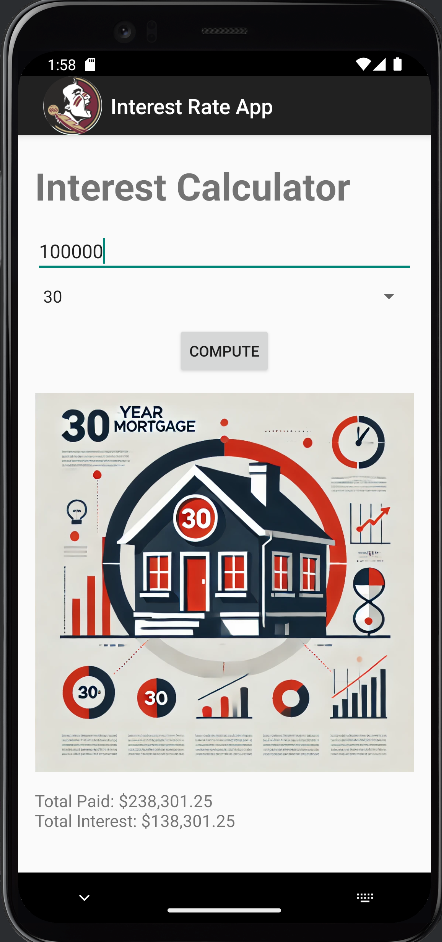
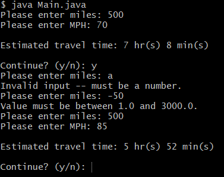
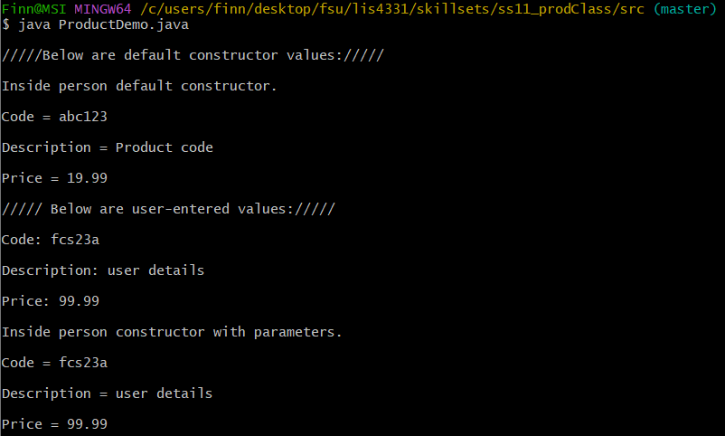
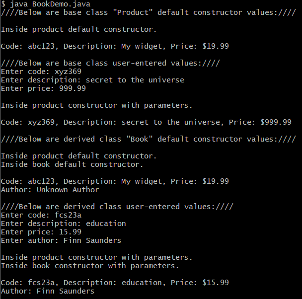

# lis4331 Advanced Mobile Application Development

## Finn Saunders

### Assignment #4 Requirements:

1. Include splash screen image (or, create your own), app title, intro text.
2. Include appropriate images.
3. Must use persistent data: SharedPreferences
4. Widgets and images must be vertically and horizontally aligned.
5. Must add background color(s) or theme
6. Create and display launcher icon image
7. App *must* be scrollable—*both* horizontally and vertically.

#### How I went above and beyond
* My Professor mentioned the possibility of using an API to fetch live mortgage rates and I found that really interesting.
* I took the time to figure out how to implement an api into my android studio emulator and the results are below

#### Assignment Screenshots:

| Splash Screen | Main Screen |
|-------------------------|-------------------------|
|  |  |

| 15 Year Calculation | 30 Year Calculation |
|-------------------------|-------------------------|
|  |  |

| SS10 | SS11 | SS12 |
|-------------------------|-------------------------|-------------------------|
|  |  |  |

