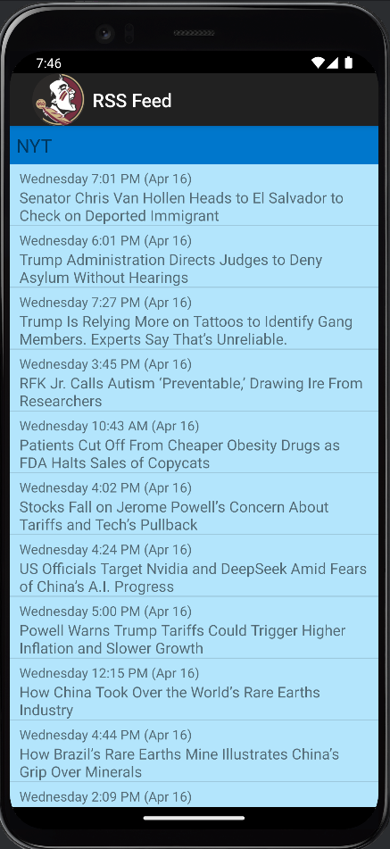
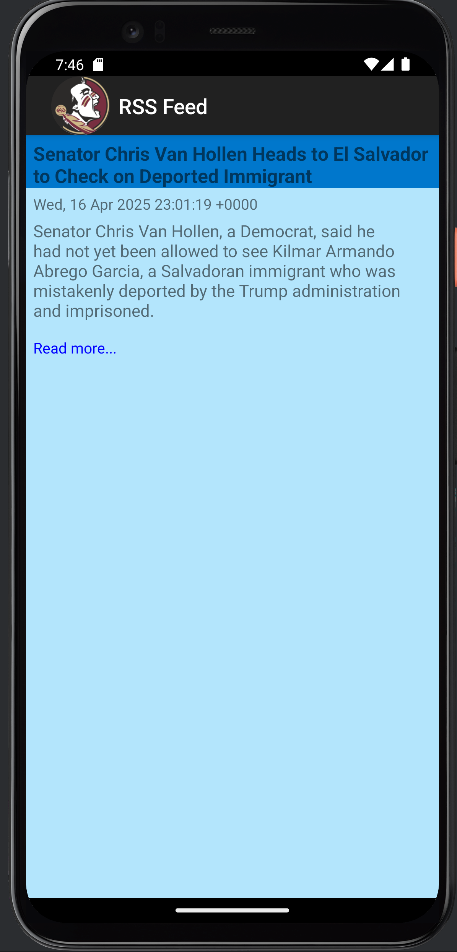
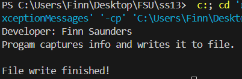
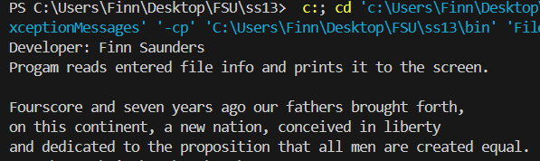
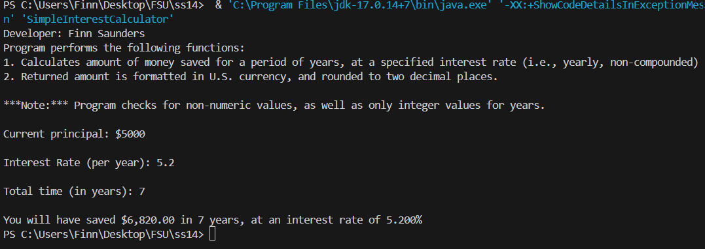
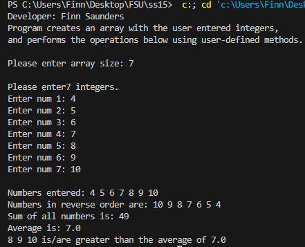

# lis4331 Advanced Mobile Application Development

## Finn Saunders

### Assignment #5 Requirements:

#### README.md file should include the following items:

1. Course title, your name, assignment requirements, as per A1;
2. Screenshot of running application's listing screen;
3. Screenshot of running application's single RSS item screen;
4. Screenshot of opened browser window;

#### Assignment Screenshots:

| Listing | Single entry | Read More |
|-------------------------|-------------------------|-------------------------|
|  |  |  |

##### Skill Sets
| SS13.1 | SS13.2 |
|-------------------------|-------------------------|
|  |  |

##### Skill Sets
| SS14 | SS15 |
|-------------------------|-------------------------|
|  |  |
