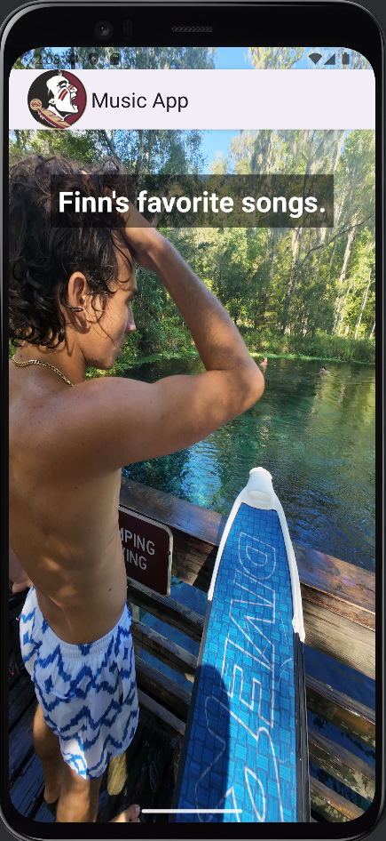
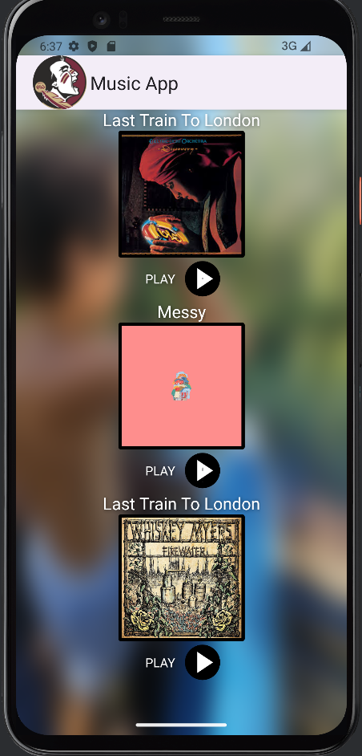
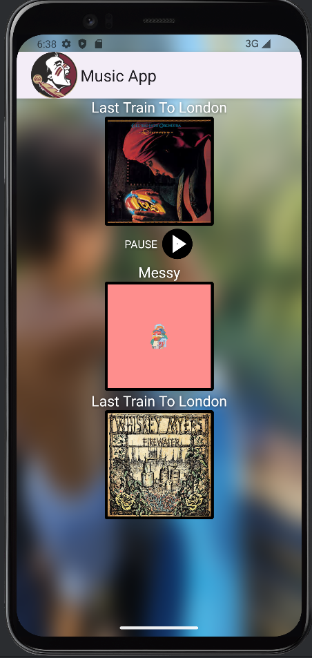
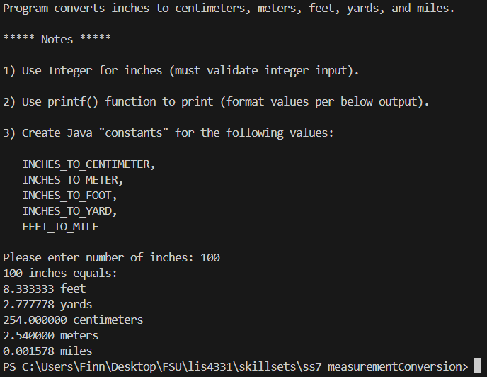
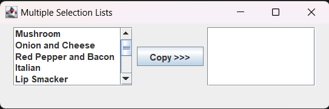
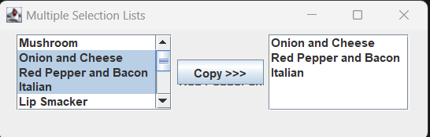
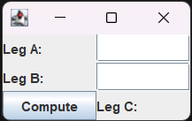
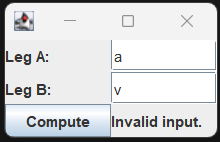
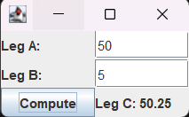

# lis4331 Advanced Mobile Application Development

## Finn Saunders

### Project #1 Requirements:

1. Include splash screen image, app title, intro text.
2. Include artists’ images and media.
3. Images and buttons must be vertically and horizontally aligned.
4. Must add background color(s) or theme
5. Create and display launcher icon image
6. App *must* be scrollable—*both* horizontally and vertically

#### README.md file should include the following items:

1. Screenshot of running application’s splash screen;
2. Screenshot of running application’s follow-up screen (with images and buttons);
3. Screenshots of running application’s play and pause user interfaces (with images and buttons);

#### Java code for this project
[Main Activity Code](docs/MainActivity.java)

#### Assignment Screenshots:

| Splash Screen | Opening Screen |
|-------------------------|-------------------------|
|  |  |

| Playing Screen | Paused Screen |
|-------------------------|-------------------------|
|  |  |

#### Skill Sets

| SS7 | SS9 Part 1 | SS9 Part 2 |
|-------------------------|-------------------------|-------------------------|
|  |  |  |

| SS8 Part 1 | SS8 Part 2 | SS8 Part 3 |
|-------------------------|-------------------------|-------------------------|
|  |  |  |

