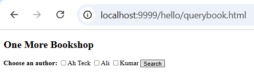
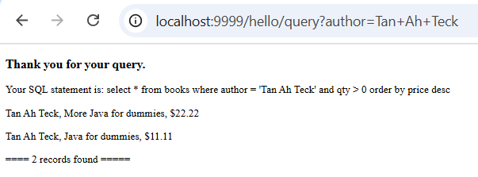
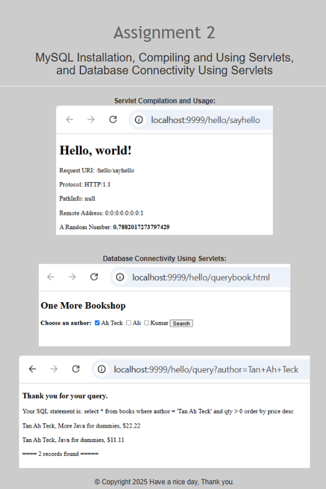
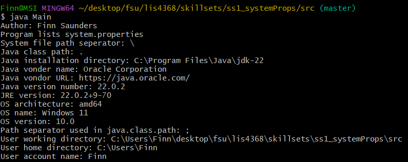
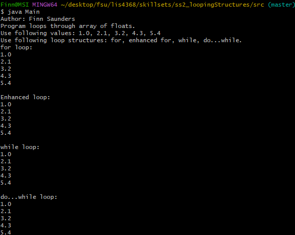
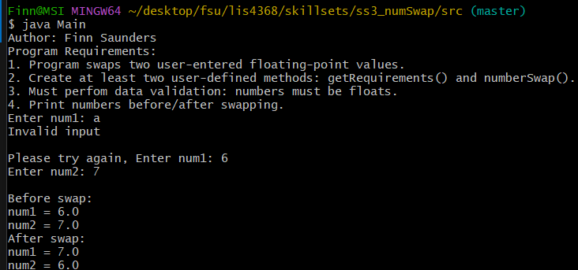

# lis4368 Advanced Web Application Development

## Finn Saunders

### Assignment #2 Requirements:

1. Finish step 2.7 and 2.8 from the tomcat tutorial
2. Verify the following links work
    * [http://localhost:9999/hello](http://localhost:9999/hello)
    * [http://localhost:9999/hello/HelloHome.html](http://localhost:9999/hello/HelloHome.html)
    * [http://localhost:9999/hello/sayhello](http://localhost:9999/hello/sayhello)
    * [http://localhost:9999/hello/querybook.html](http://localhost:9999/hello/querybook.html)

#### README.md file should include the following items:

* Assessment links
* Webpage screenshots
* Skillset screenshots

#### Assignment Screenshots:

| Querybook.html | Query Results | A2 Index |
|-------------------------|-------------------------|-------------------------|
|  |  |  |

#### Skillset Screenshots:
##### (Click on the Main/Methods to view my code)
|SS1 System Properties - [Main.java](../skillsets/ss1_systemProps/src/Main.java) , [Methods.java](../skillsets/ss1_systemProps/src/Methods.java) | SS2 Looping Structures - [Main.java](../skillsets/ss2_loopingStructures/src/Main.java) , [Methods.java](../skillsets/ss2_loopingStructures/src/Methods.java) | SS3 Number Swap - [Main.java](../skillsets/ss3_numSwap/src/Main.java) , [Methods.java](../skillsets/ss3_numSwap/src/Methods.java) |
|-------------------------|-------------------------|-------------------------|
|  |  |  |

