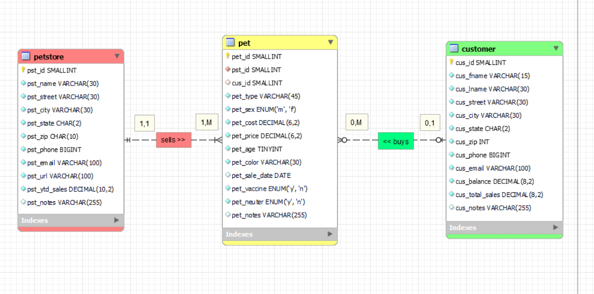
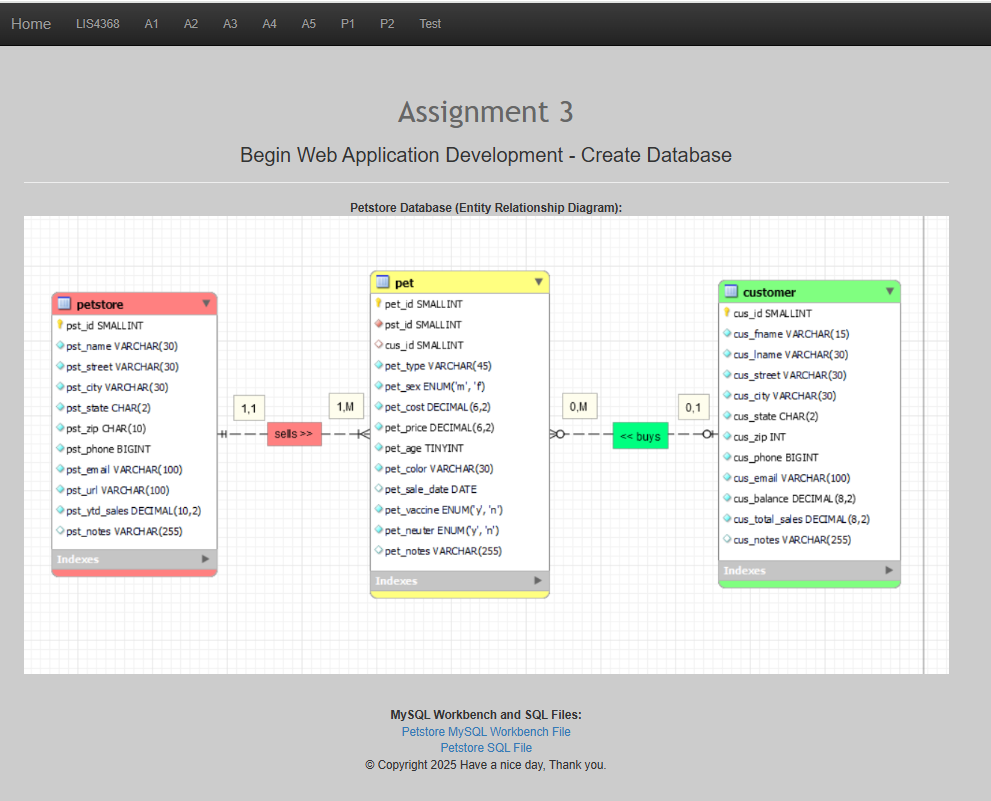
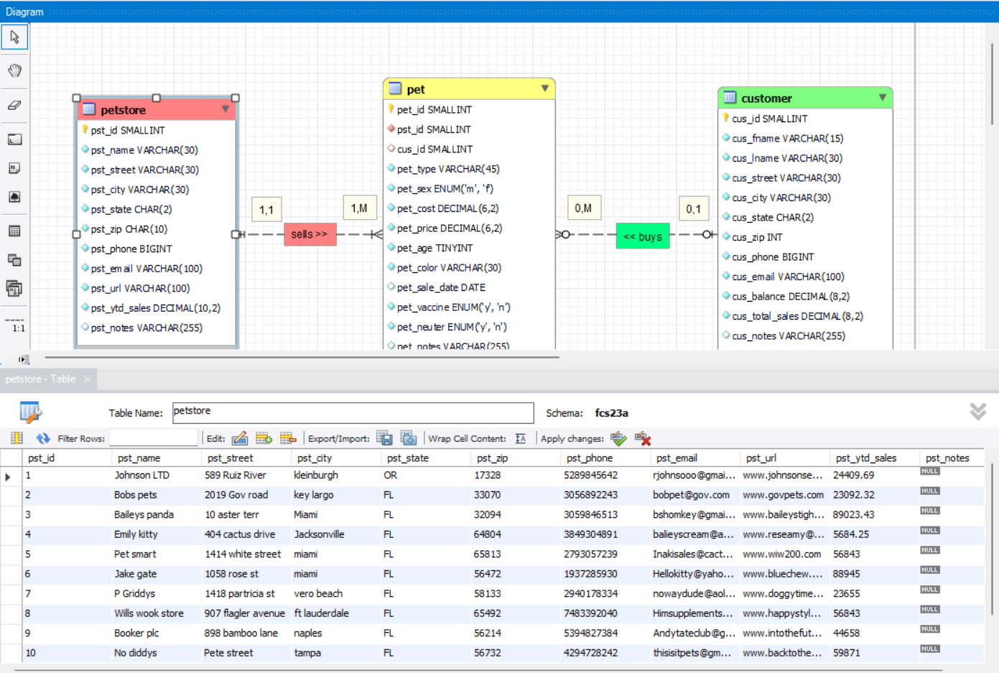
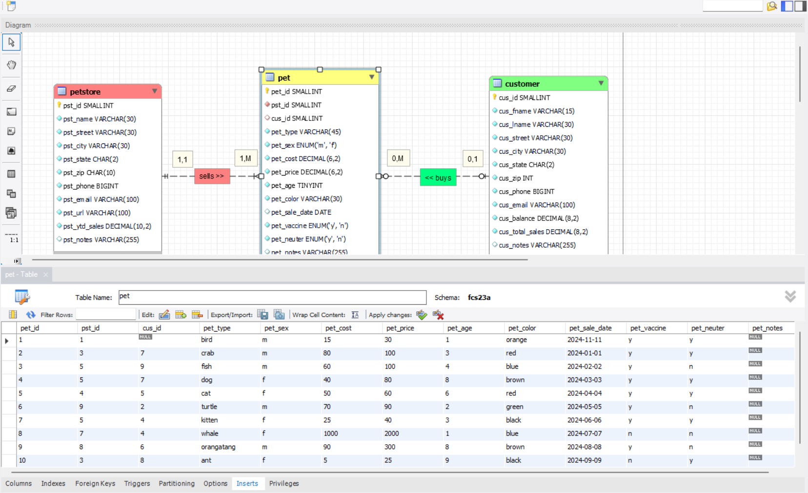
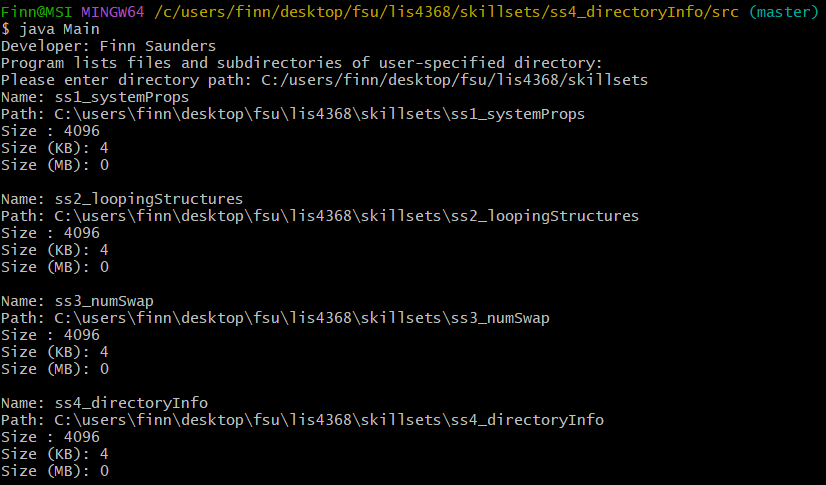
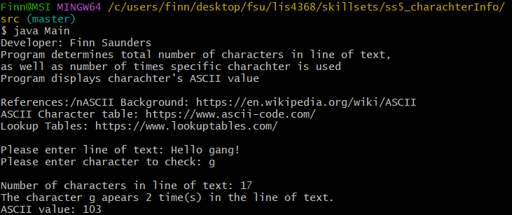
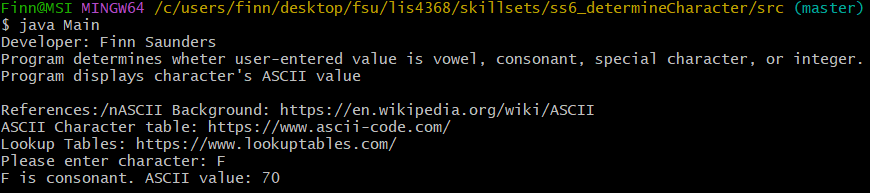

# lis4368 Advanced Mobile Application Development

## Finn Saunders

## Finn Saunders

### Assignment #3 Requirements:

1. Provide Bitbucket read-only access to course repo.
2. README.md must include screenshots per above (see examples below).
3. FSU’s Learning Management System: Bitbucket repo link

#### README.md file should include the following items:

1. Course title, your name, assignment requirements, as per A1;
2. Screenshot of ERD;
3. Screenshots of 10 records for each table—use select * from each table;
4. Links to the following files:

##### Associated Documents
* [a3.mwb](docs/a3.mwb)
* [a3.sql](docs/a3.sql)

 
#### Assignment Screenshots:

| Entity Relationship Diagram    |  Webapp Index   | 
|------------|------------|
|  |  |

| *Records from the petstore table*:    |  *Records from the pet table*:   | *Records from the customer table*:  |
|------------|------------|------------|
|      |  | | 

| Screenshot of Skillset four:    |  Screenshot of Skillset five:   | Screenshot of Skillset six:  |
|------------|------------|------------|
|      |  | |