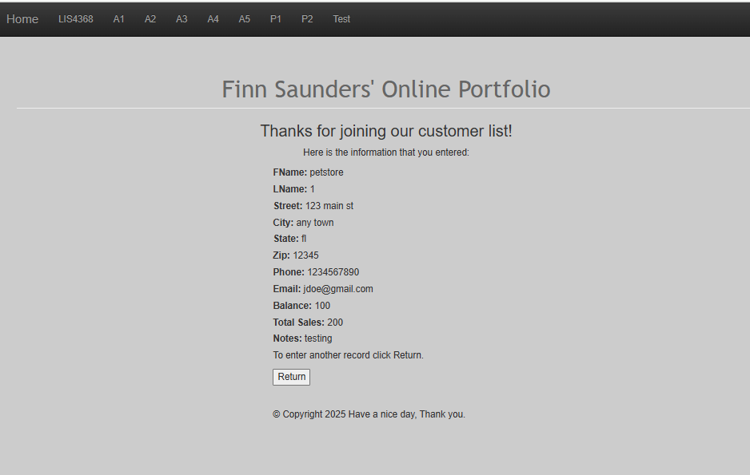
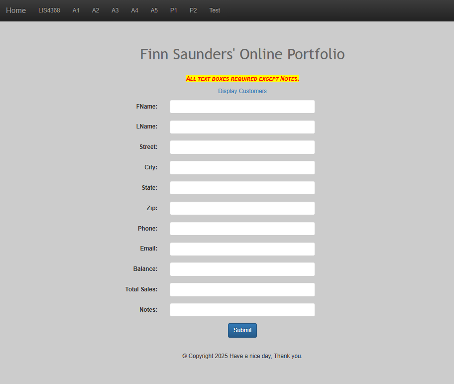
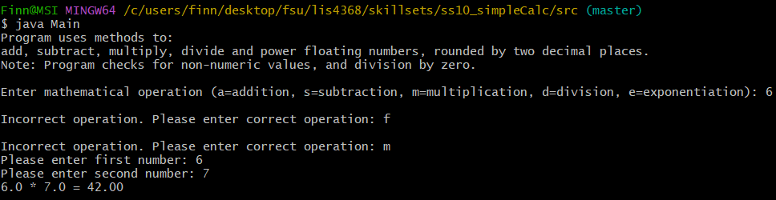
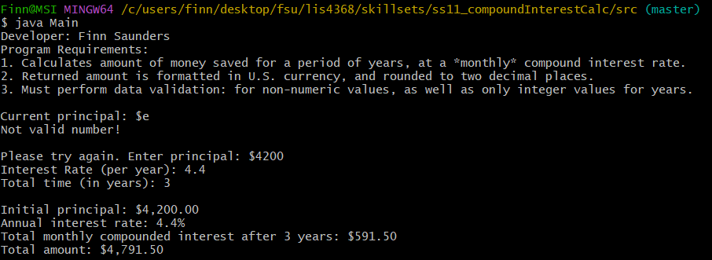
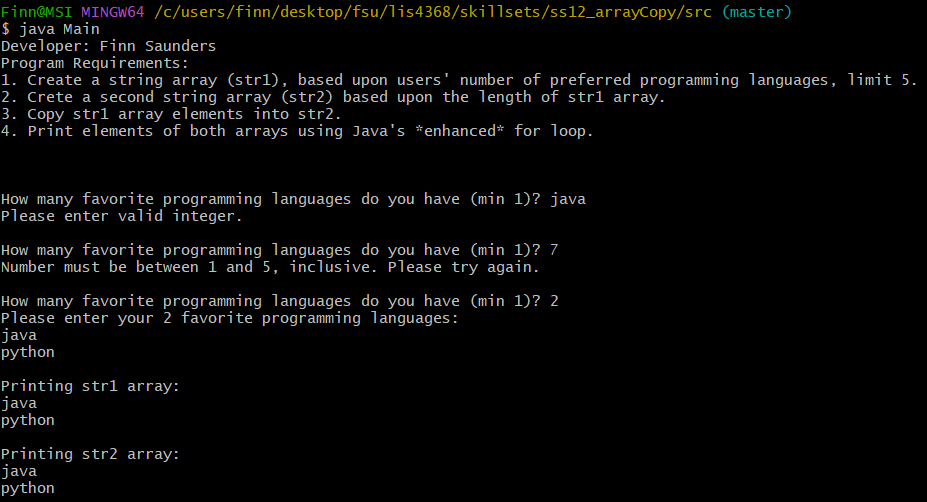

# lis4368 Advanced Web Application Development

## Finn Saunders

### Assignment #4 Requirements:

1. Establish server-side validation
2. Compile servlet
3. Chapter Questions (Chp. 11 & 12)
4. Skillsets 10-12

#### README.md file should include the following items:

* Screenshot of Failed Validation
* Screenshot of Passed Validation
* Screenshot of Skillset 10
* Screenshot of Skillset 11
* Screenshot of Skillset 12

#### Assignment Screenshots:

*Screenshot of Passed Validation*:

*Screenshot of Passed Invalidation*:

| SS10 | SS11 | SS12 |
|-------------------------|-------------------------|-------------------------|
|  |  |  |

