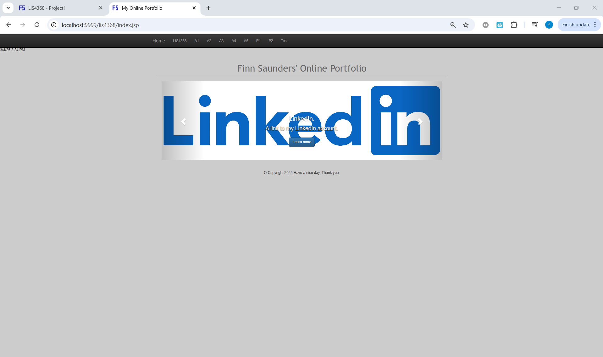
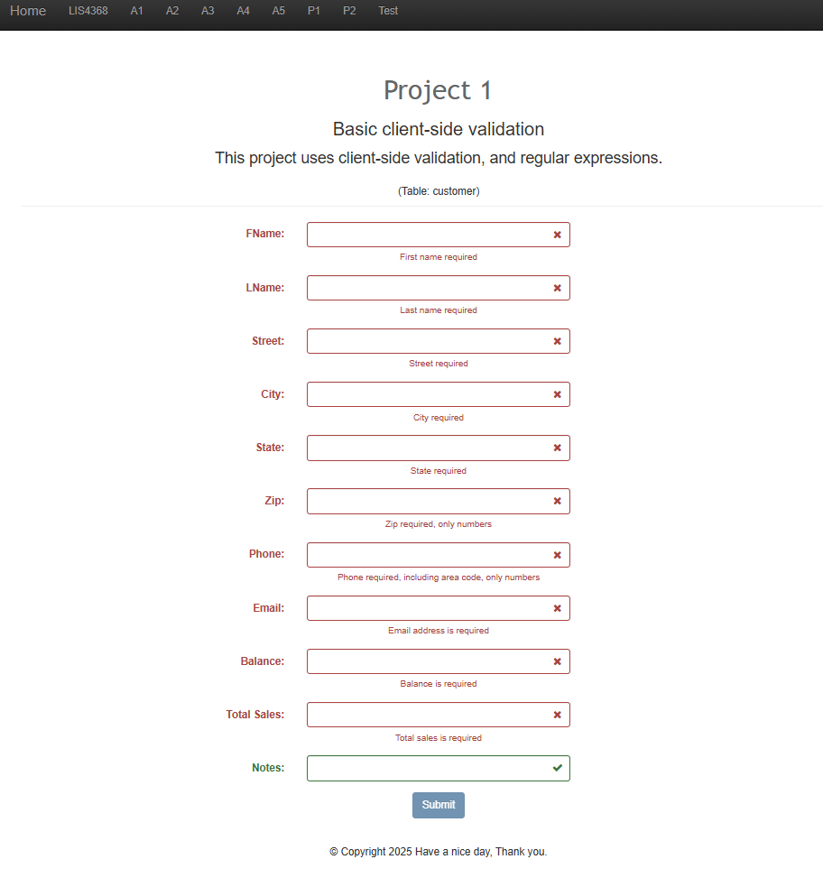
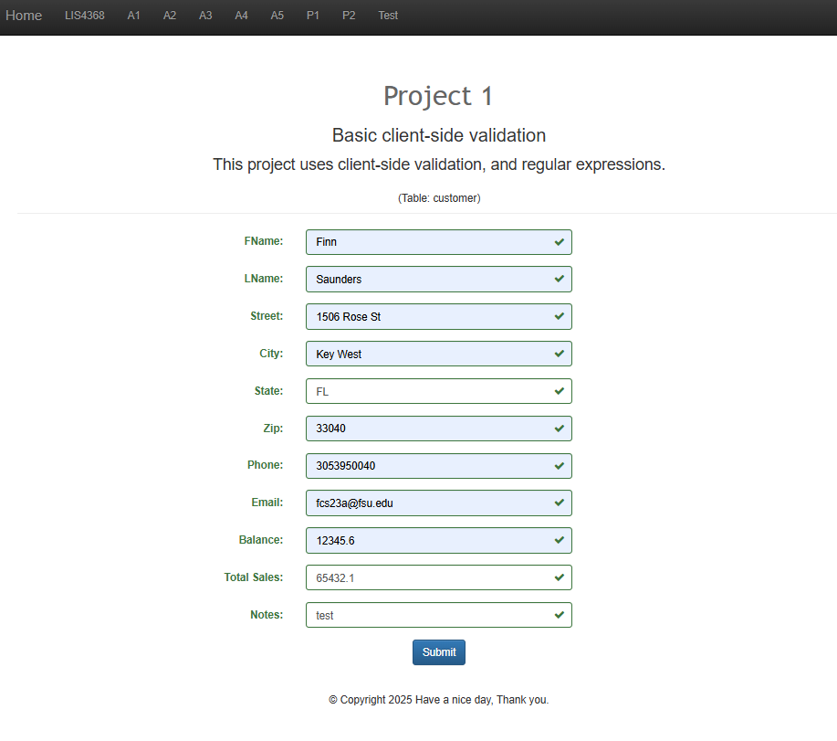
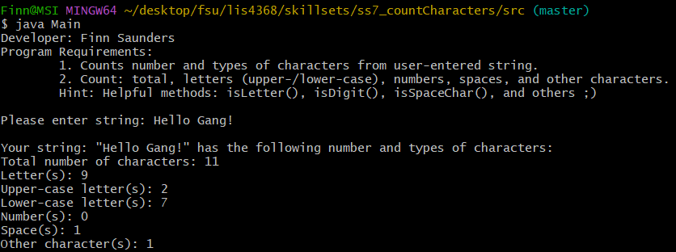
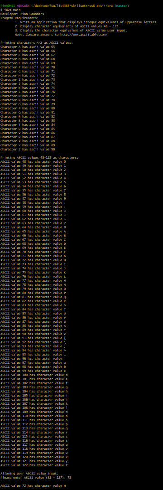
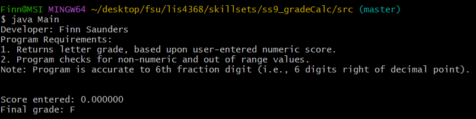

# lis4368 Advanced Web Application Development

## Finn Saunders

### Project #1 Requirements:

1. Suitably modify meta tags
2. Change title, navigation links, and header tags appropriately
3. Add form controls to match attributes of customer entity
4. Use regexp to only allow appropriate characters for each control

#### Assignment Screenshots:

##### Index

| Failed Validation | Passed Validation |
|-------------------------|-------------------------|
|  |  |

| SS7 | SS8 | SS9 |
|-------------------------|-------------------------|-------------------------|
|  |  | |

