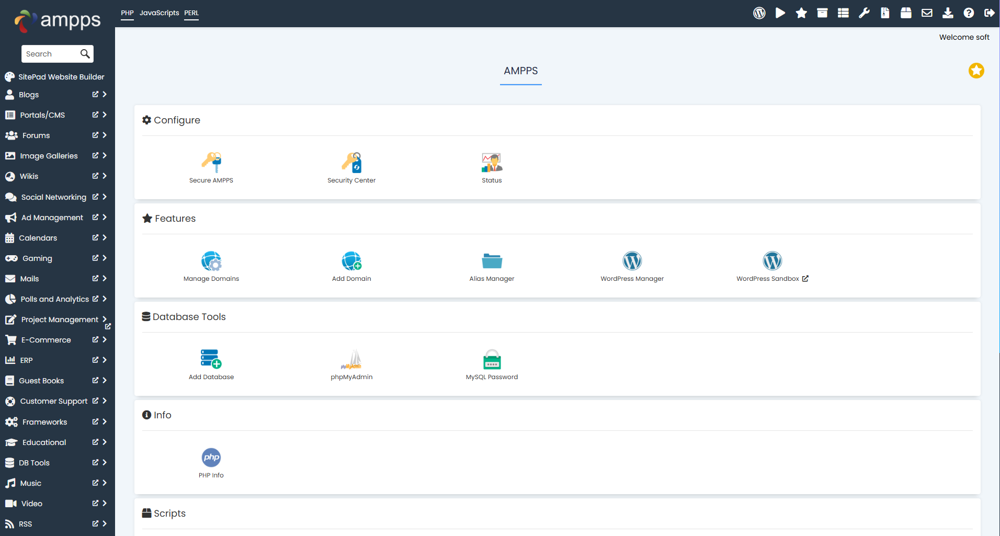
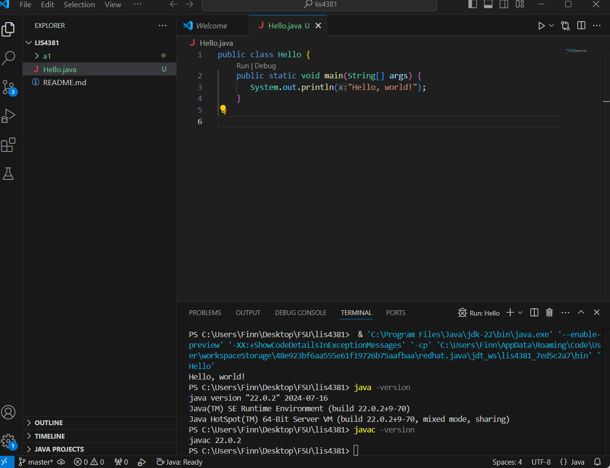

# lis4381 Mobile Web Application Development

## Finn Saunders

### Assignment #1 Requirements:

1. Distributed Version control with Git and Bitbucket
2. Development installations
3. Chapter Questions (1 & 2)

#### README.md file should include the following items:

* Screenshot of AMPPS installation
* Screenshot of java Hello
* Screenshot of Android Studio - My First App
* git commands with short descriptions
* Bitbucket repo links

> #### Git commands w/short descriptions:

1. git init - Create an empty Git repository or reinitialize an existing one
2. git status - Show the working tree status
3. git add - Add file contents to the index
4. git commit - Record changes to the repository
5. git push - Update remote refs along with associated objects
6. git pull - Fetch from and integrate with another repository or a local branch
7. git-log - Show commit logs

#### Assignment Screenshots:

*Screenshot of AMPPS running http://localhost*:

*Screenshot of running java Hello*:

*Screenshot of Android Studio - My First App*:

