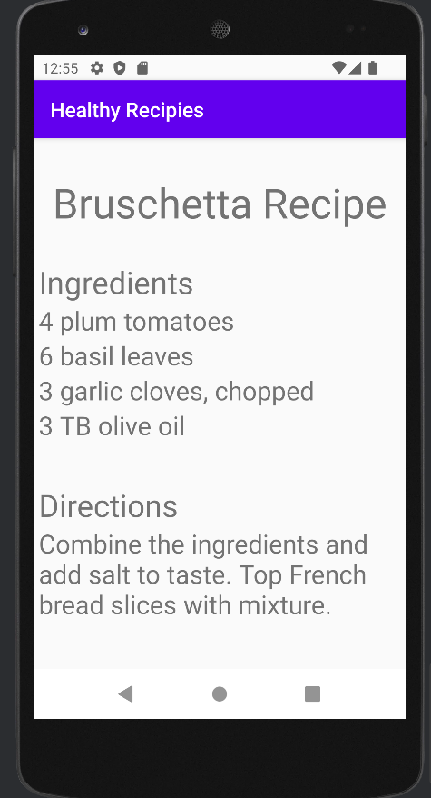
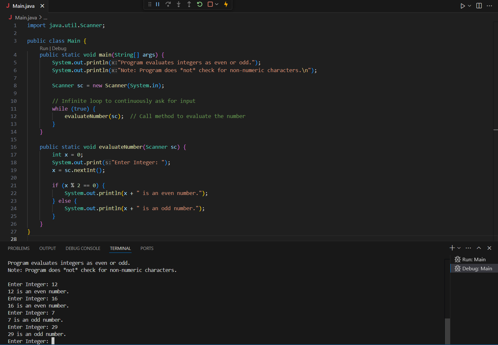
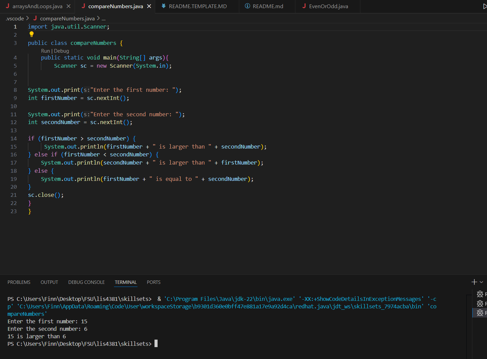
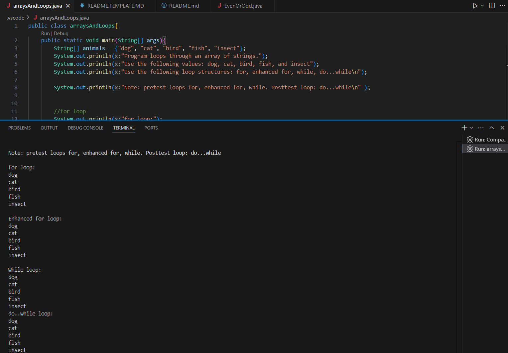

# lis4381 Mobile Web Application Development

## Finn Saunders

### Assignment #2 Requirements:

1. Create a mobile app to showcase a recipe
2. Answer chapters 3 and 4 questions
3. Complete skillsets 1,2,3

#### README.md file should include the following items:

* Course title, your name, assignment requirements, as per A1;
* Screenshot of running application’s first user interface;
* Screenshot of running application’s second user interface;
* Screenshot of skill sets;

#### Assignment Screenshots:

*Screenshot of screen1 in my app*:

*Screenshot of screen2 in my app*:

| *Screenshot of Skillset one*:    |  *Screenshot of Skillset two*:   | *Screenshot of Skillset three*:  |
|------------|------------|------------|
|      |  | |

