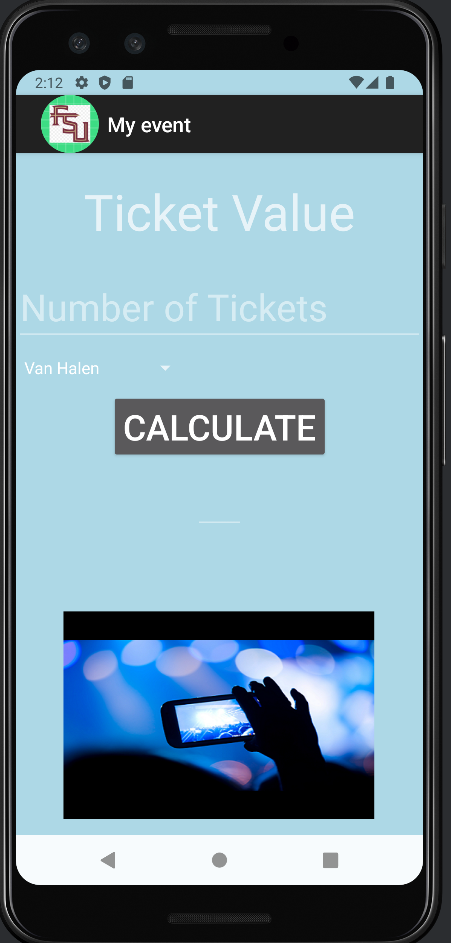
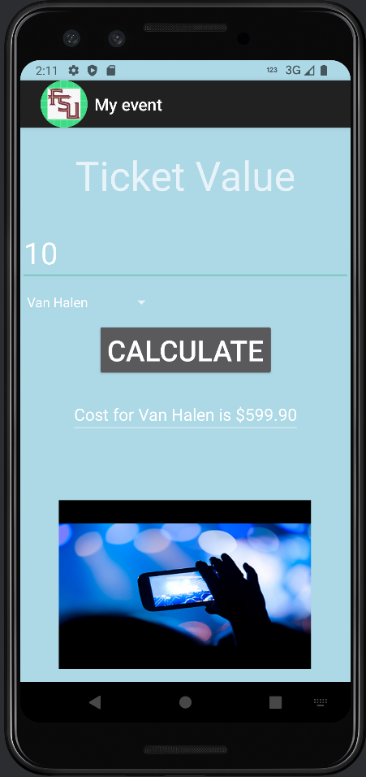
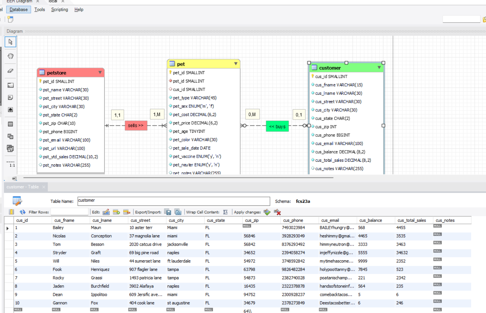
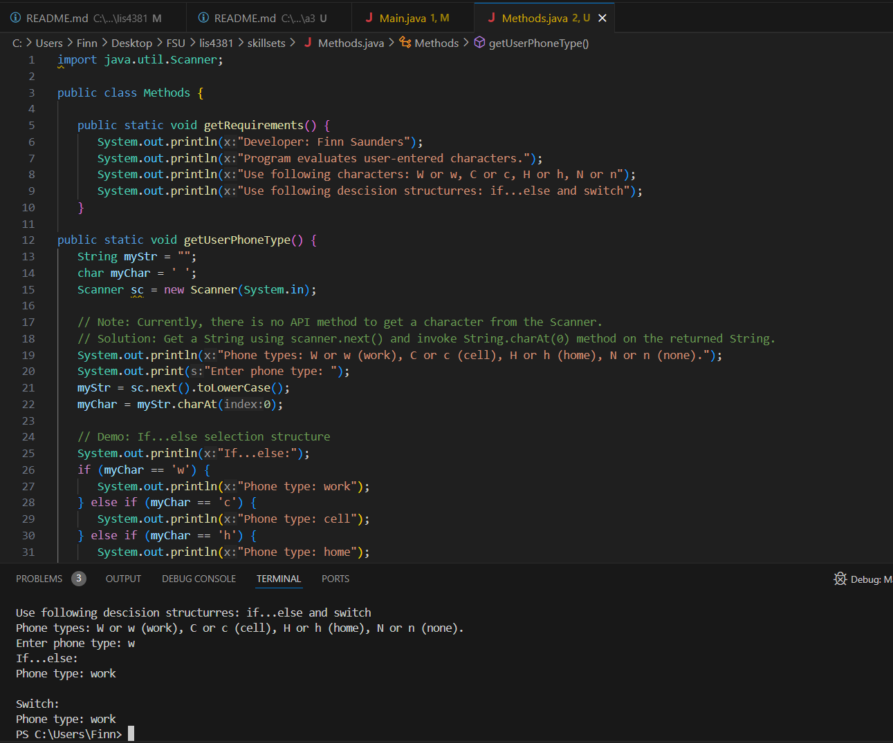
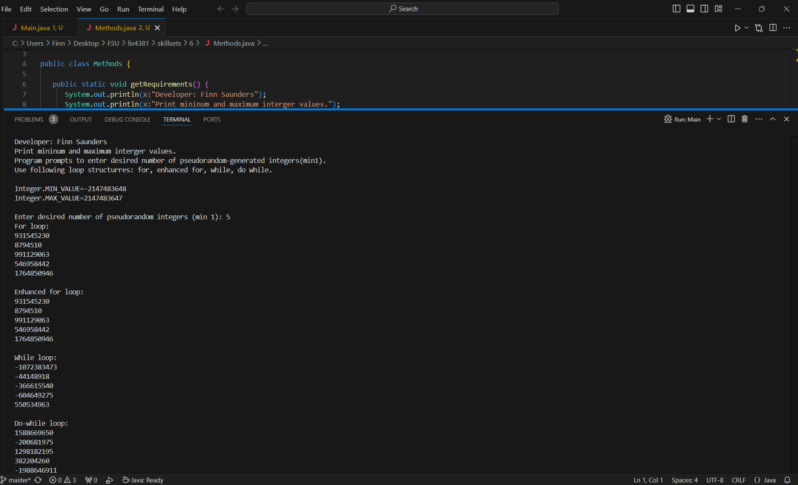
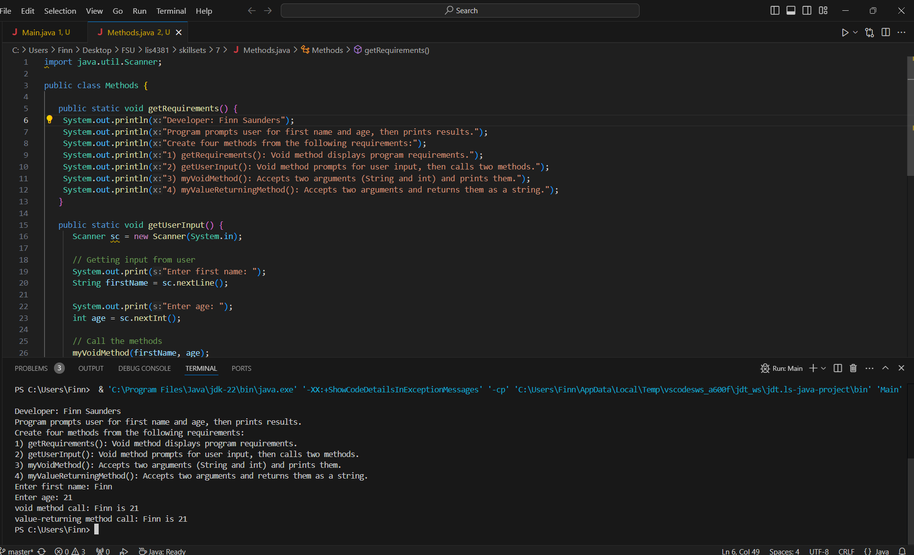

# lis4381 Mobile Web Application Development

## Finn Saunders

### Assignment #3 Requirements:

1. Provide Bitbucket read-only access to course repo.
2. README.md must include screenshots per above (see examples below).
3. FSU’s Learning Management System: Bitbucket repo link

#### README.md file should include the following items:

1. Course title, your name, assignment requirements, as per A1;
2. Screenshot of ERD;
3. Screenshot of running application’s opening user interface;
4. Screenshot of running application’s processing user input;
5. Screenshots of 10 records for each table—use select * from each table;
6. Links to the following files:
a. a3.mwb
b. a3.sql

 
#### Assignment Screenshots:

*Screenshot of my app before values*:

*Screenshot of my app with values*:

1. [ERD Screenshot](img/erd_screenshot.png)
2. [Link to SQL](docs/a3.sql)

| *Records from the petstore table*:    |  *Records from the pet table*:   | *Records from the customer table*:  |
|------------|------------|------------|
|      |  | | 

| *Screenshot of Skillset four*:    |  *Screenshot of Skillset five*:   | *Screenshot of Skillset six*:  |
|------------|------------|------------|
|      |  | |

