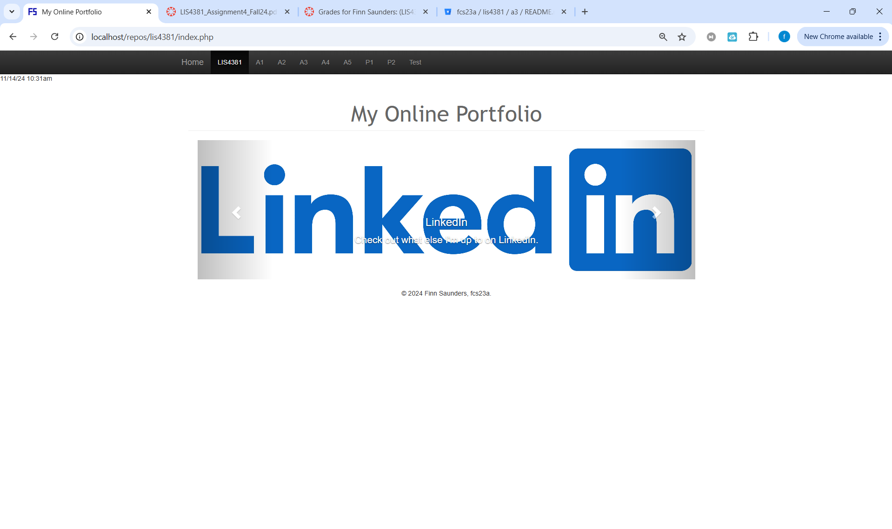
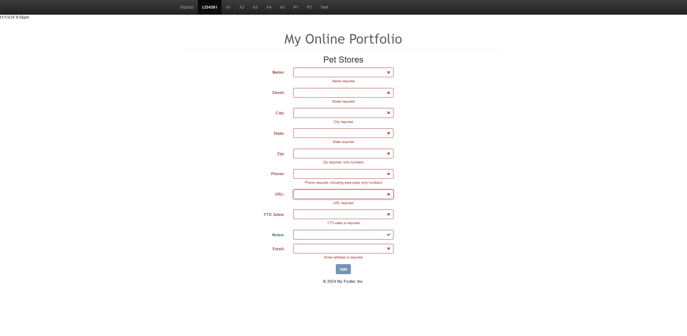
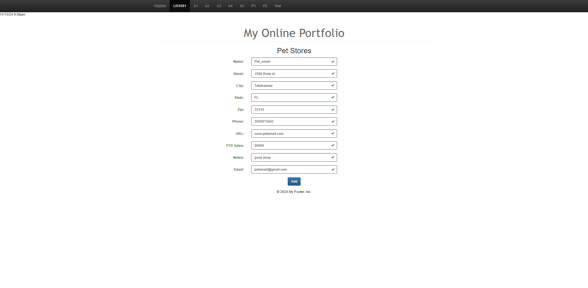
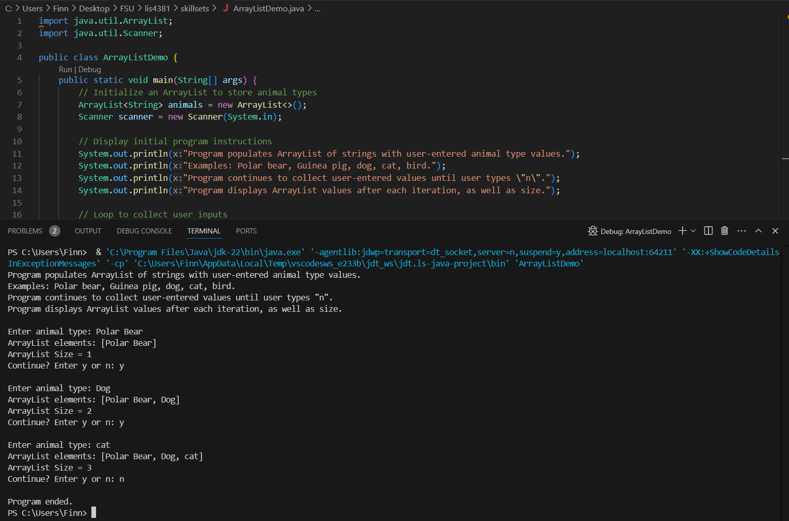
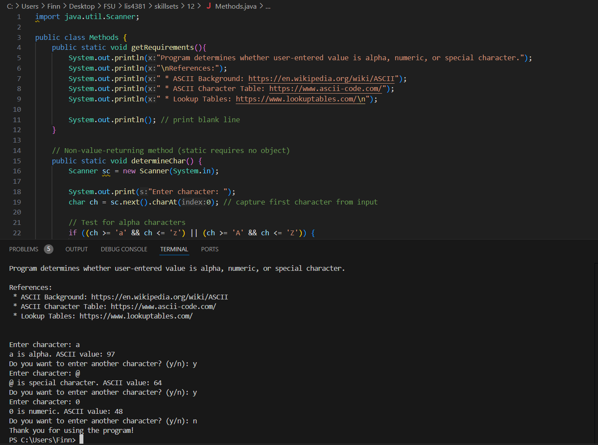
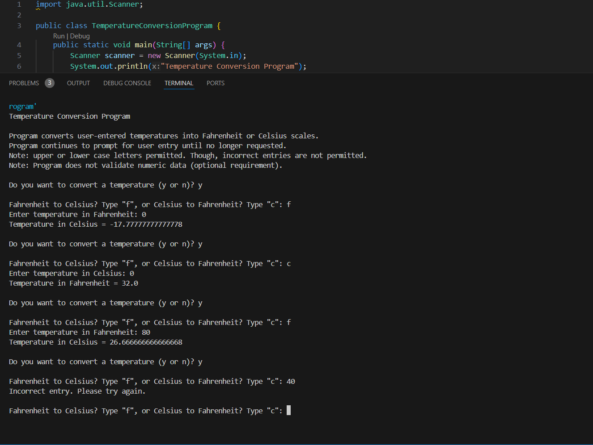

# LIS4381  MOBILE WEB APPLICATION DEVELOPMENT

## Finn Saunders

### Assignment 4 Requirements:
A4 Requirements: 

1. cd to local repos directory.
2. Clone starter files to the directory.
3. Review PHP Code and code client validation.
4. Skillsets 10, 11, and 12.

#### README.md file should include the following items:

* Screenshot of Main page
* Screenshot of Failed Validation
* Screenshot of Passed Validation

  
* [http://localhost/repos/lis4381/index.php](http://localhost/repos/lis4381/index.php) 

#### Assignment Screenshots:

*Screenshot Main page:     

   

 *Screenshot Failed Validation*:

*Screenshot Passed Validation*:

  

| *Screenshot of Skillset 10*:    |  *Screenshot of Skillset 11*:   | *Screenshot of Skillset 12*:  |
|------------|------------|------------|
|      |  | |

