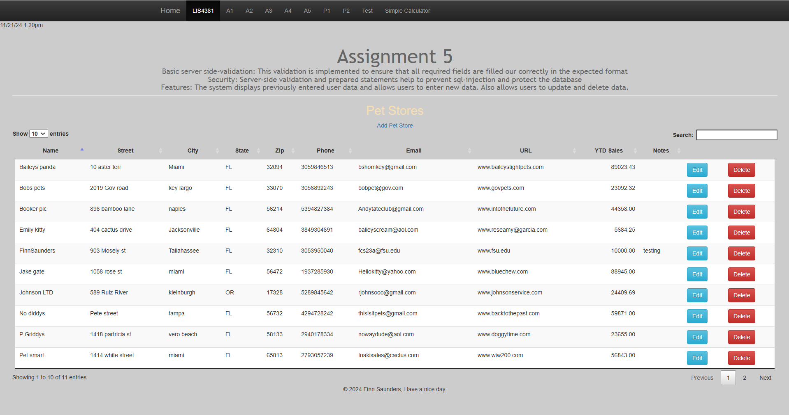
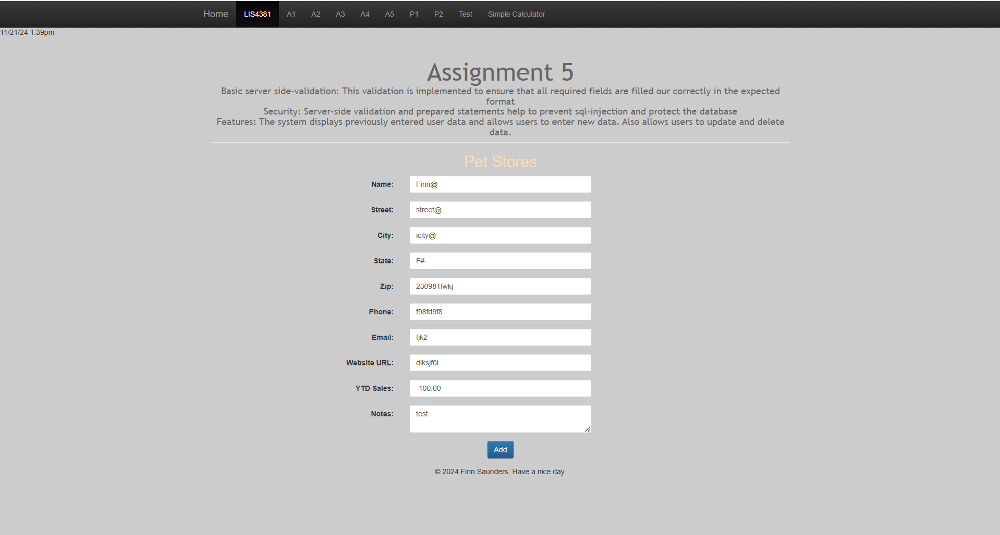
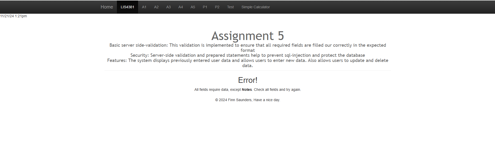
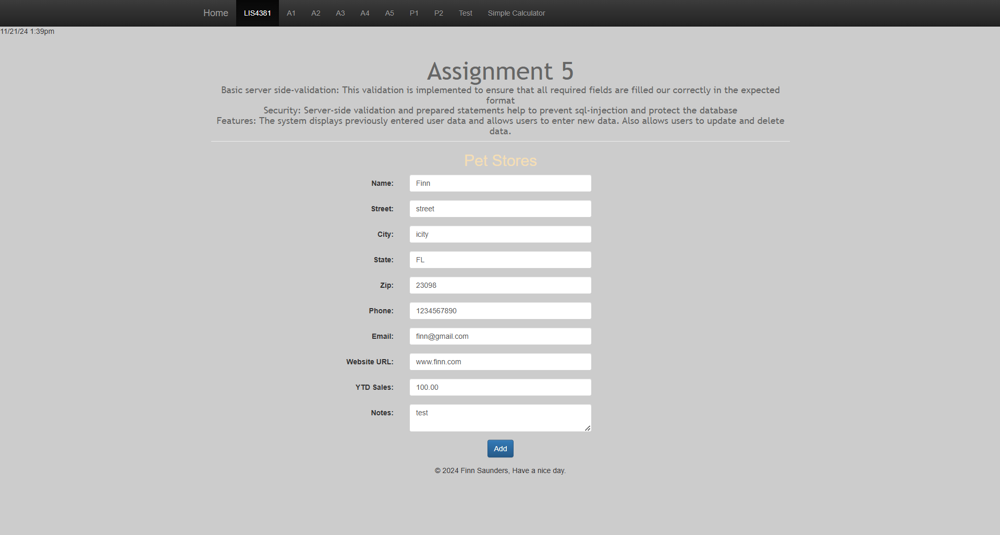
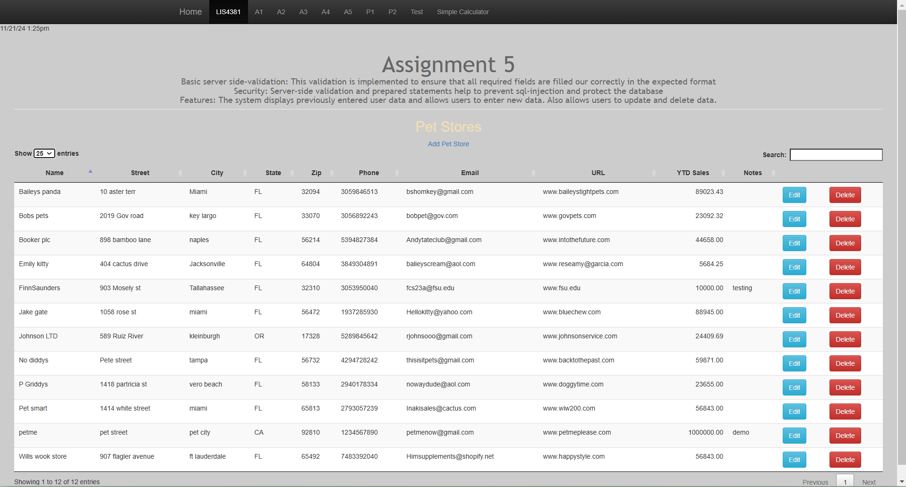
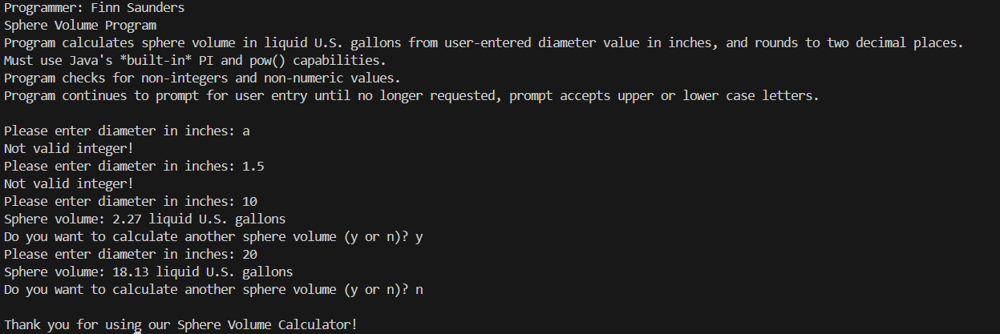
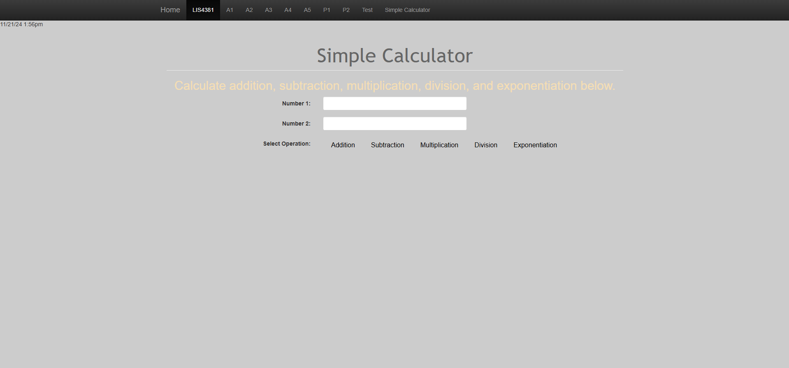
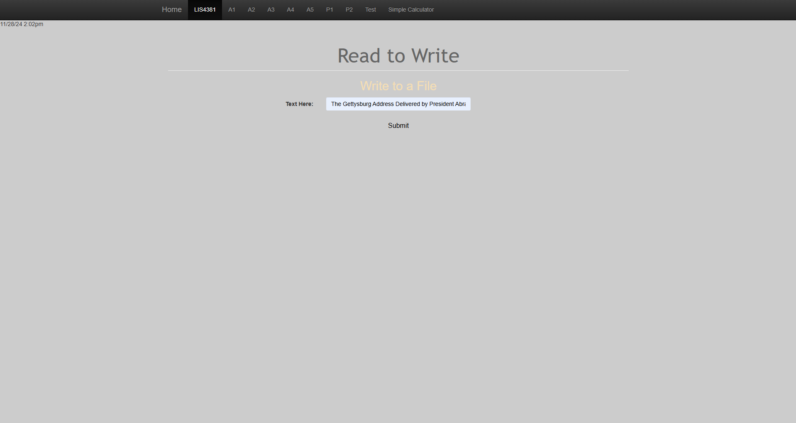
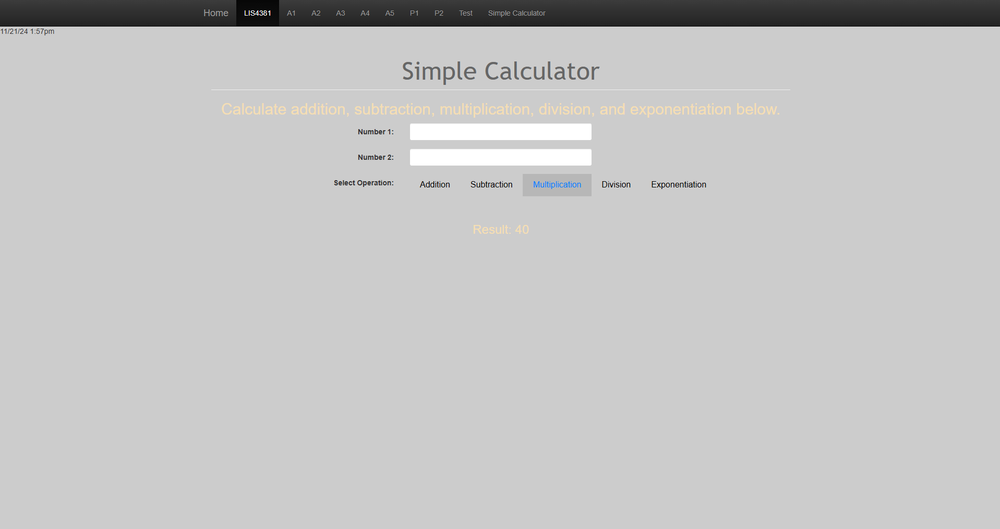
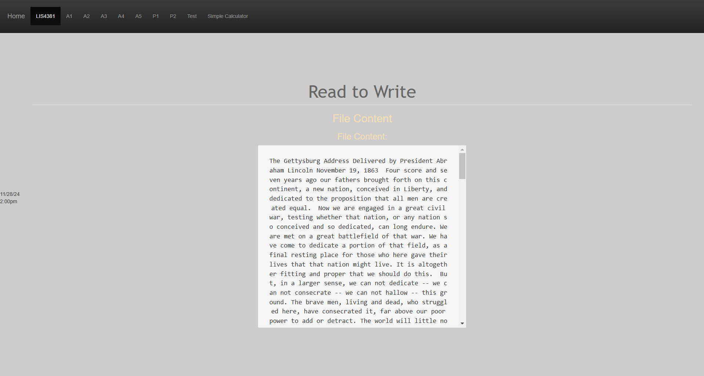

# LIS4381  MOBILE WEB APPLICATION DEVELOPMENT

## Finn Saunders

### Assignment 5 Requirements:
A5 Requirements:

1. Server-side Validation
2. Provide screenshots of functioning website and skill sets
3. Review PHP Code
4. Skillsets 13, 14, and 15.

#### README.md file should include the following items:

* Screenshot of main page
* Screenshot of failed validation
* Screenshot of passed validation
* Screenshot of invalid data
* Screenshot of passed validation
* Skillsets 13, 14, 15

  
* [http://localhost/repos/lis4381/index.php](http://localhost/repos/lis4381/index.php) 

#### Assignment Screenshots:

*Screenshot Main page:     

   

*Screenshot Invalid Validation*:

*Screenshot failed Validation:

*Screenshot valid data:

*Screenshot passed Validation:

  

| *Screenshot of Skillset 13*:    |  *Screenshot of Skillset 14*:   | *Screenshot of Skillset 15*:  |
|------------|------------|------------|
|      |  | |
|      |  | |

