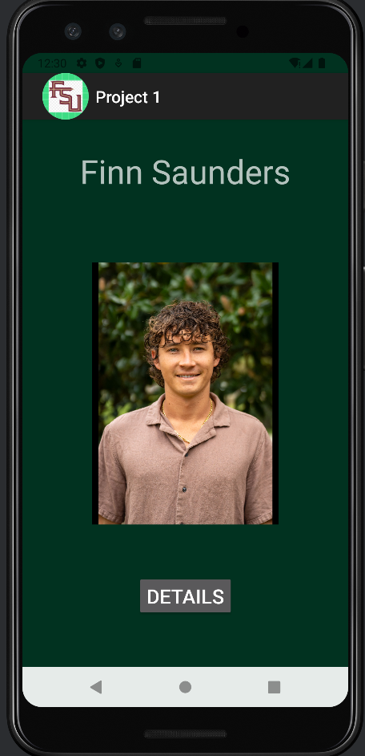
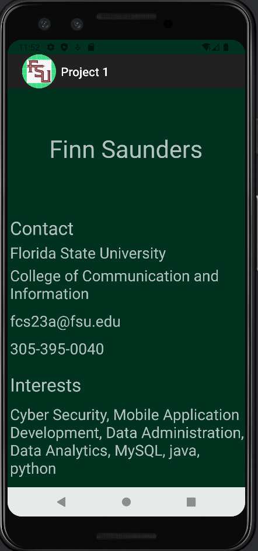
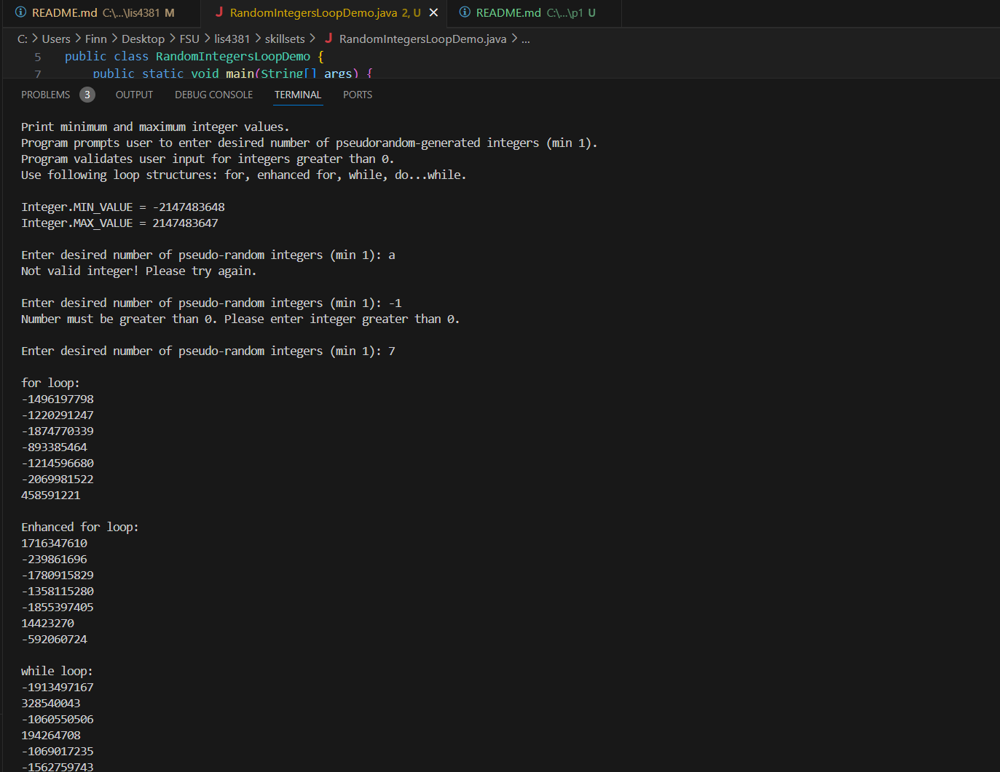
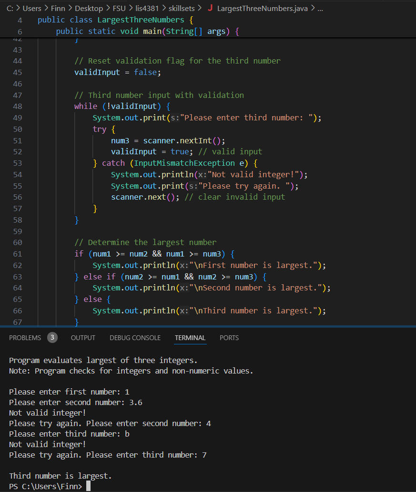
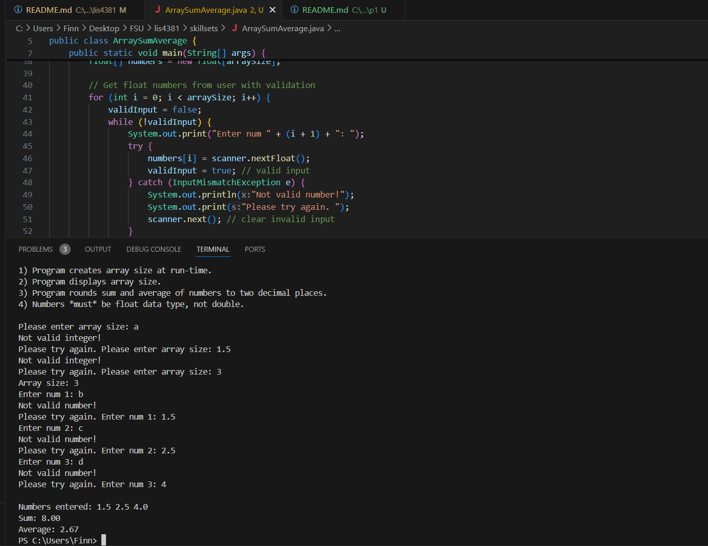

# lis4381 Mobile Web Application Development

## Finn Saunders

### Project 1 Requirements:

1. Create a mobile app for my business card
2. Apply concepts from past assignments to document my learning.
3. Include my image, contact information, and interests
4. Use a launcher icon and display it in both activities
5. Ensure background color is added, image/button border, and text shadow

#### README.md file should include the following items:

1. Course title, your name, assignment requirements, as per A1;
2. Screenshot of running application’s first user interface;
3. Screenshot of running application’s second user interface;

 
#### Assignment Screenshots:

*Screenshot of my app on the home page*:

*Screenshot of my app on the details page*:

| *Screenshot of Skillset seven*:    |  *Screenshot of Skillset eight*:   | *Screenshot of Skillset nine*:  |
|------------|------------|------------|
|      |  | |

