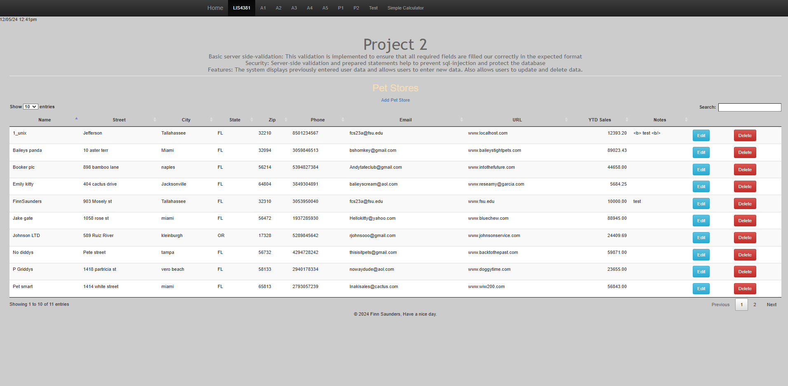
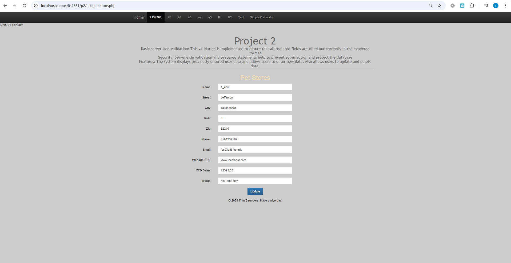
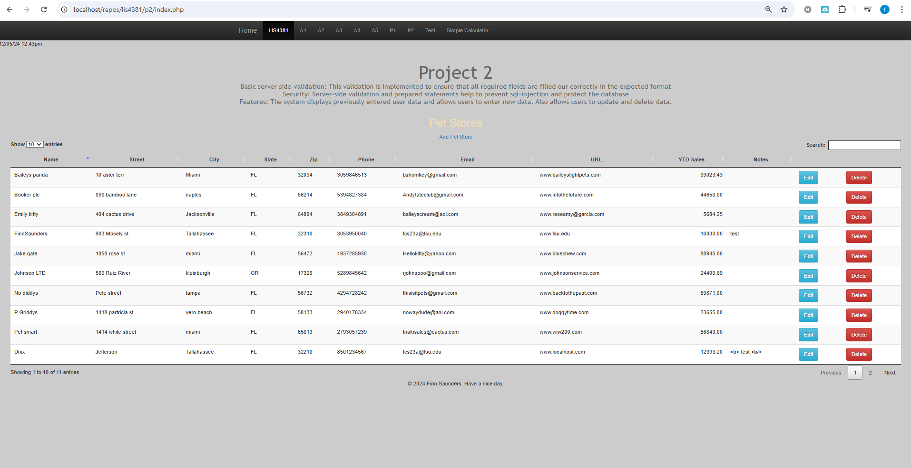
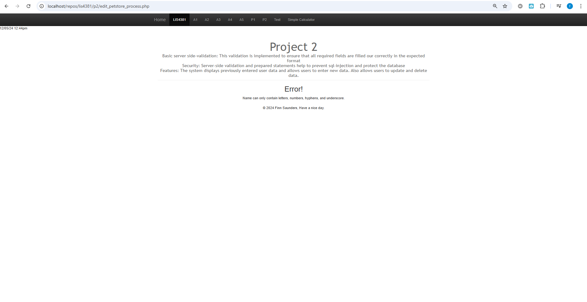
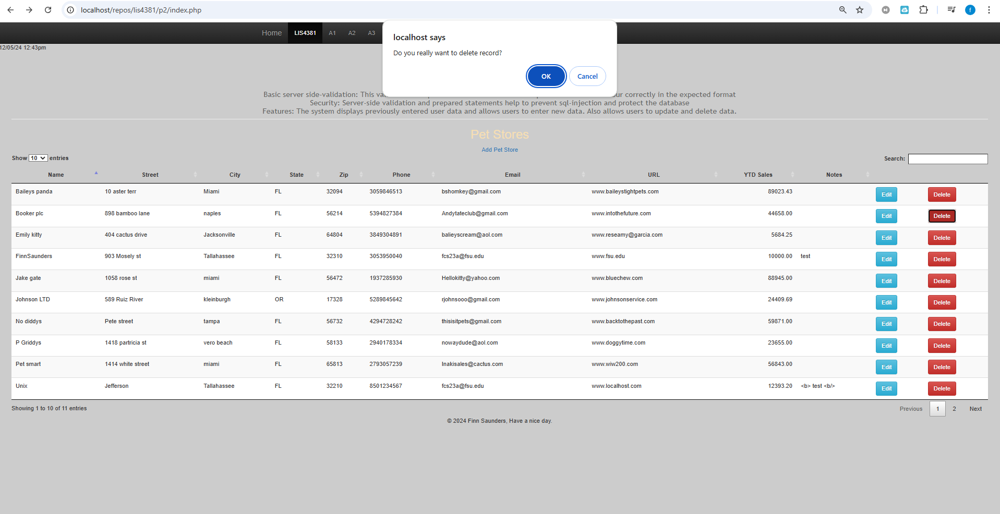
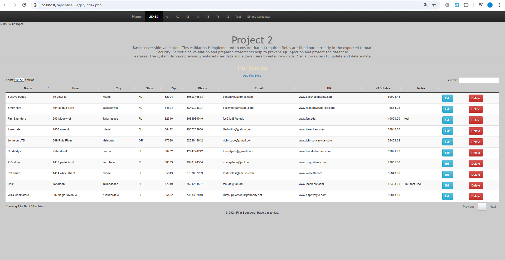
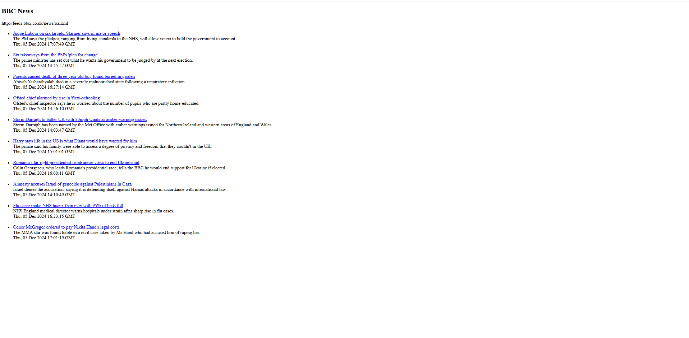

# LIS4381  MOBILE WEB APPLICATION DEVELOPMENT

## Finn Saunders

### Project 2 Requirements:
P2 Requirements:

1. Edit Functionality
2. Delete Functionality
3. RSS Feed

#### README.md file should include the following items:

* Screenshot of Carousel page
* Screenshot of index
* Screenshot of edit_petstore.php
* Screenshot of invalid data
* Screenshot of passed validation
* Screenshot of delete attempt
* Screenshot of delete success
* Screenshot of RSS

  
* [http://localhost/repos/lis4381/index.php](http://localhost/repos/lis4381/index.php) 

#### Assignment Screenshots:

*Screenshot Carousel page:     

   

 *Screenshot Index:

*Screenshot edit_petstore.php:

*Screenshot Passed Validation:

*Screenshot failed Validation:

*Screenshot delete attempt:

*Screenshot delete validation:

*Screenshot of RSS:

  

