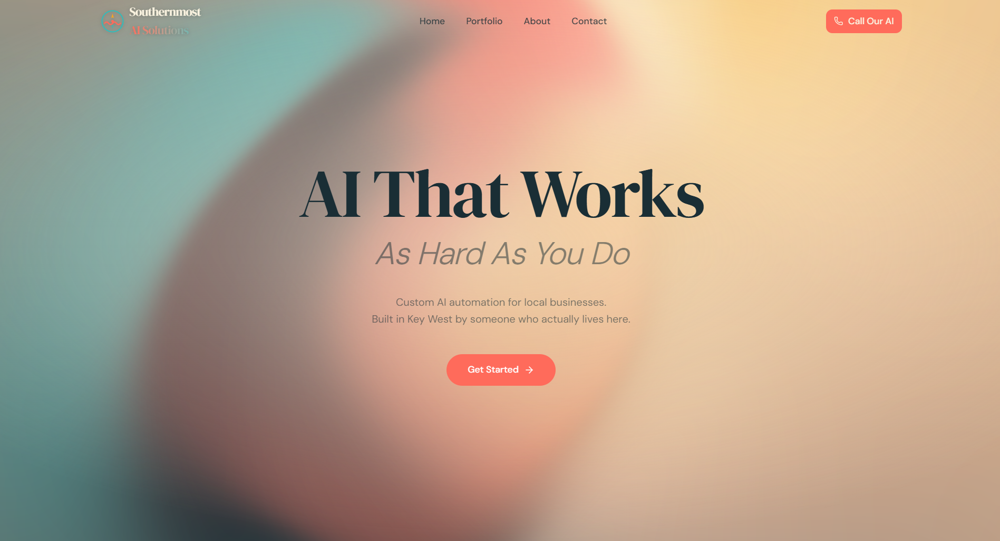
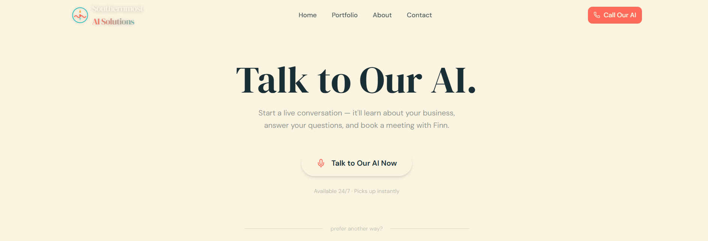
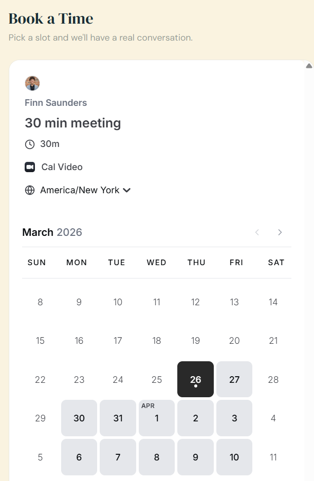
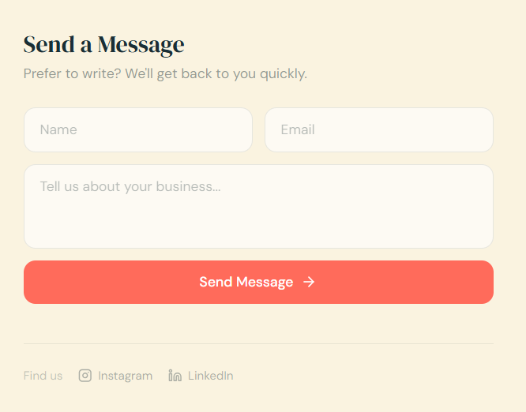
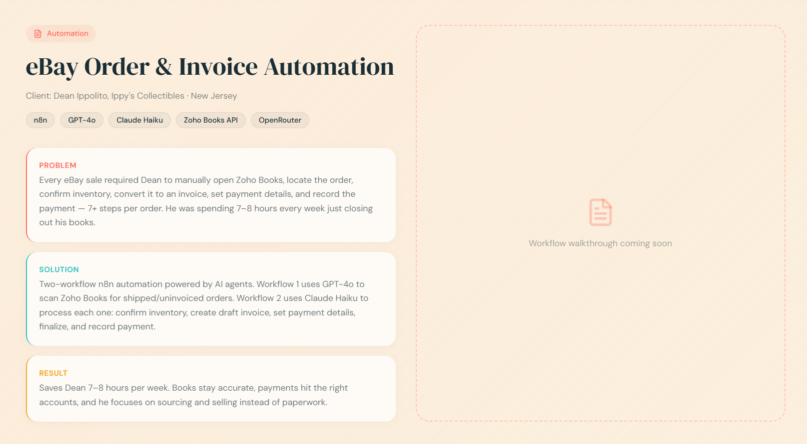
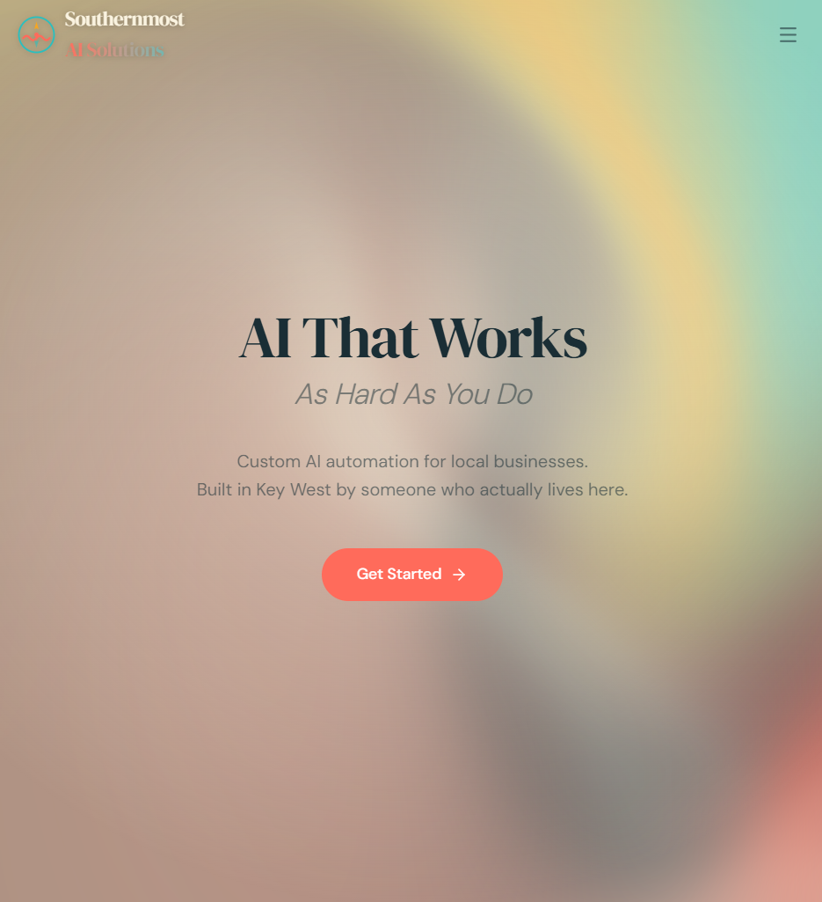

# Southernmost AI Solutions - Company Website

## Finn Saunders

### Overview:

I built this website for my own business, Southernmost AI Solutions, an AI automation consultancy based in Key West, FL. The goal was to create a professional web presence that not only showcases my services and past client work, but also actively generates leads. Rather than relying on a static contact page, I integrated multiple ways for potential clients to reach out — including a live AI voice agent that can answer questions and book meetings directly from the site.

### Site Features:

- Home page with animated background and service overview
- Embedded AI voice agent that visitors can call directly from the browser to ask questions or schedule a consultation
- Calendar booking system embedded on the contact page so clients can see availability and book meetings in real time
- Contact form with automated email delivery
- Portfolio section highlighting real client projects with results
- Fully responsive mobile layout with adaptive navigation

### Screenshots:

*Screenshot of Home Page*:

*Screenshot of Voice Agent*:

*Screenshot of Calendar Booking*:

*Screenshot of Contact Form*:

*Screenshot of Portfolio Section*:

*Screenshot of Mobile View*:

